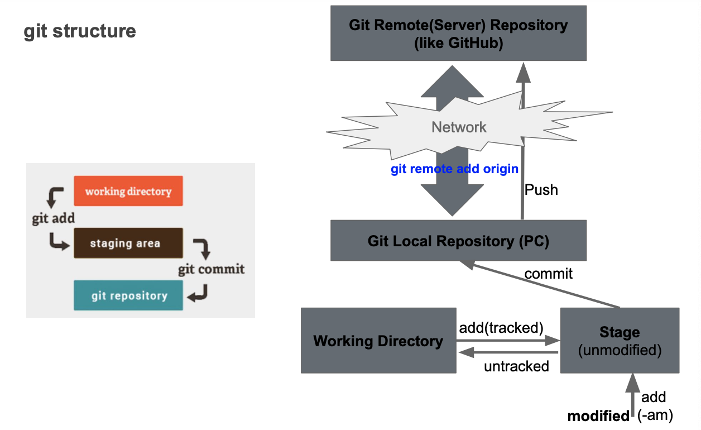
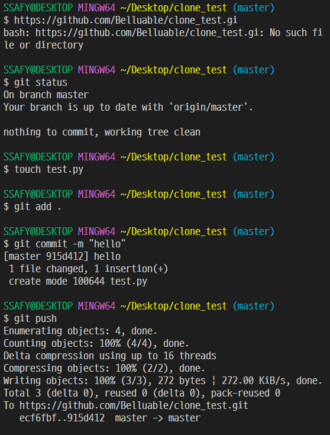
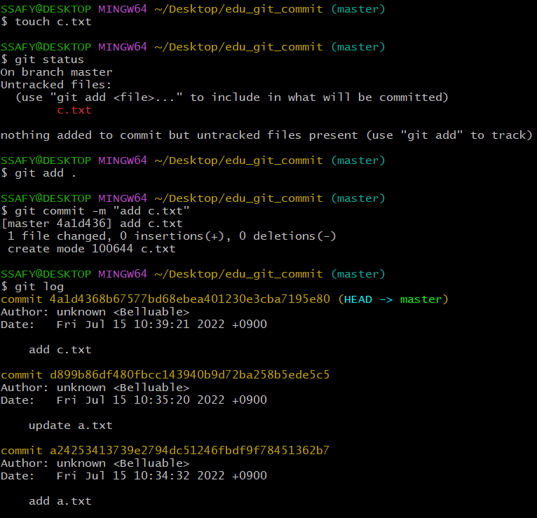

# Git

## Git ⭐

- [공식문서](https://git-scm.com/book/ko/v2/Git-브랜치-브랜치란-무엇인가)
- 분산 버전 관리 프로그램
- Linux 만든 사람이 만들어서 bash를 사용하면 모든 linux 환경에서 접근 가능
- 최종 파일 1개 + 변경사항만 저장한 파일 여러개
- 하나 터져도 복구 가능
- 협업이 목적
- TIL(Today I Learned): 오늘 배운 내용 정리
    - 마크다운으로 정리

### Git structure




| git structure | 실행 코드 | 상태 |
| --- | --- | --- |
| working directory |  |  |
|  | git add | untracked → tracked |
| staging area |  | 임시 저장공간, staged, tracked
파일이 삭제되고 commit 되기 전까지 트랙킹함 |
|  | git commit | commit 전까지는 메모리에만 있음 (ex. 생각만) |
| git repository |  | local/ remote, 실제 저장공간 |
|  | git push | git server에 올림 |
|  | git pull | server거 가져옴 |
| server |  | ex. github |

Q. 충돌시에 어떻게 작동되나?

- [블로그 참조](https://techblog.lotteon.com/git-브랜치를-머지할-때-충돌이-발생할-수-있는-사례-d72a21c520a5)

Q. stage와 repository의 차이?

- stage: 작업본, repository: 최종본
- 실수로 전송/충돌 방지
- remote repository(git server) 때매, 공동작업
- history가 중요하기 때문에 diff를 떠볼 수 있음
   

**Working Directory**

- 내가 작업하고 있는 **실제 디렉토리**

**Staging Area**

- **커밋**으로 남기고 싶은, **특정 버전**으로 관리하고 싶은 파일이 있는 곳
- 잠깐 머무는 곳
- 다 저장하면 크기가 커지니까

**Repository**

- 특정 디렉토리를 버전 관리하는 저장소
- **커밋**들이 저장되는 곳
- **특정 버전**으로 남긴다 = **“커밋한다”**
- Local Repository: 컴퓨터
- Remote Repository: gitlab, github
   
|  | 코드 | 설명 | 추가설명/ 상태 |
| --- | --- | --- | --- |
|  | .git 파일 | 버전 관리에 필요한 모든 것이 들어있음 |  |
| 0 | git init | 로컬 저장소 생성 |  |
| 1 | git status | 현재 git으로 관리되고 있는 파일들의 상태 |  |
| 2 | git add | 변경사항을 working directory → repository | untracked 상태 |
| 2 | git add . | 현재 장소의 모든 것 add 해줘 |  |
| 3 | git commit -m “수정함” | staging area → repository | tracked 상태 |
| - | repository → working directory | 가장 최신 commit이랑 현재 파일 비교 |  |
|  | :q | quit |  |
|  | :wq | write & quit 저장하고 나가기 |  |
| 4 | git log | 커밋한 정보 알려줌 |  |
|  | git diff A B | A에 비해서 B가 어떻게 바꼈는가 | A, B에 git log 쳐서 나온 커밋 앞 4자리 입력 |
| 1 | git remote add origin {remote_repo} | origin: <repo_name> 별명, 대체로 origin 씀/ remote_repo: github 주소 url | github 연결 |
| 2 | git push A B : git push origin master | A: 어디로 push할 건지/ B: 브랜치 master | *branch: 커밋들이 쌓이고 있는 흐름 |
| 3 | git push -u origin master | 이거하면 앞으로 git push만 치면됨 | local → remote |
| 4 | git clone {remote_repo} | github 복제 |  |
|  | code . | 파일 코드로 열기 |  |
- 실습
    
    ```jsx
    git config --global user.name "Belluable"
    git config --global user.email ""
    
    git status  # 수정 사항 있는지 확인
    git add .   # 바뀐부분 업데이트
    git commit -m "오타 수정"   # commit
    git push   # git에 업로드
    git log    # 여태까지 작업한 내역 확인
    git pull   # 가져오기
    
    rm -rf .git  # master 지우기
    ```
    
    
    
    
    
- 자격 증명 지우기
    
    제어판> 자격 증명 관리> window 자격 증명> 일반 자격 증명> 지울 사이트 제거
    
   
### Gitignore

- git에 공개적으로 올라가지 말아야할 폴더/파일을 자동으로 커밋이 안되게 해주는 기능
- .gitignore 파일에 숨길 폴더/파일명을 적고 저장하면 됨
    - *.txt : txt 파일 전체 ignore
    - ignore/, ignore/* : ignore 폴더 전체 ignore
- .gitignore에 넣어야될 거 알려주는 사이트
    - window, python 등을 사용할때 자동으로 생성되는 것들 숨김처리
    
    [gitignore.io](https://www.toptal.com/developers/gitignore/)
    
- .gitkeep 파일을 만들면 폴더 내 파일들이 모두 ignore 돼있어도 빈 폴더로 git에 올라감
    - .gitkeep이 없고 폴더 내 파일 모두 ignore이면 폴더는 git에 올라가지 않음
- VScode 에서 커밋할 때는 commit을 길게 쓸 수 있음
    
    <aside>
    🗒️ 커밋 제목
    한줄 공백
    자세한 내용
    
    </aside>

   
### commit

- 공간상/db에 저장

```bash
git add .
git commit -m "commit"
git commit -am "commit"  # add(등록된,tracked된 애들만), commit 한번에

# push
git push -u origin master/main  # -u: upstream

# file 보기
git ls-files  # git이 관리해주는 파일, tracked된 파일들
git ls-files -u  # conflict 난 파일 보여줌

# diff
git diff --name-only  # diff for HEAD
git diff HEAD~1  # 이전 커밋과의 차이

# 서버와 연결된 repo 끊기
git remote rm origin
```

   
### restore(unstaged) VS rm(untracked)

- restore: rollback, rm 취소
- rm —cache : 메모리에서만 제거, untracked, WD에만 있음, commit해야만 완전히 삭제됨
- tracked → `rm --cache` → untraked(WD) & deleted(stage)
→ `restore --staged` → unmodified(stage), 원위치(취소됨)
- modified: unstaged = WD로 갔다/ tracked는 돼있음(등록돼있으니까)
- diff를 다 모으면 WD 상태

```bash
# untracked
git rm a.js  # cache 안붙이면 완전 삭제됨
git rm a.js --cache   # 파일 원본 유지, 메모리에서만 삭제

# unstaged (rollback)
git add a.js
git restore a.js
```

Q. remove VS clean

- rm: tracked → untracked
- clean: untracked 된 애들을 지움
    - 안쓰는 파일이지만 남아있어야하면 gitignore를 사용해서 clean에서 제외

   
### branch

- default branch: 나무의 메인 줄기 = master = main
- 독립적인 작업공간을 만들기 위해 사용함
- 특정 버전: 브랜치 딸때의 버전 그대로 가져옴, 버전 고를 수 있음(HEAD~1)
- checkout: 가지 하나 치는거
- commit id는 branch 단위
- master: 배포용(push는 여기서) - develop - A,B

```bash
git branch  # 브랜치 확인

# 브랜치 생성
git branch A  # 브랜치 만들기
git branch user-auth  # 자주 쓰는 이름 (auth: 가입, 인증)
git checkout A  # 브랜치 이동
git switch A
git checkout -  # 이전 브랜치
git checkout -b B  # B 생성 후 이동
git switch -c C  # C 생성 후 이동

# add & commit
git push origin A
git branch -v  # 커밋 당시 마스터브랜치의 commit ID 확인 가능
git branch -r  # remote
git branch -a  # local + remote
git log A

# remote
git remote -v  # 원격 저장소 링크 + tracking
git remote show origin  # 링크 + 정보
git branch -avr

# 브랜치 삭제
git branch -d A
git branch -D A
git push origin --delete A
git fetch -p  # 다른 폴더에서는 fetch -p 해야 적용됨

git branch --no-merged  # branch에서 commit 후 merge 필수
```

   
### stash

- 작업 중에 긴급 수정사항이 있을 때, commit 못할 때 stash에 임시 저장해둠
- .tmp - 컴퓨터 껐다켜도 남아있어야하니까
- 혼자 작업할 때 많이 씀
- 여럿이 작업: branch

```bash
git stash save  # 작업중인걸 임시저장
git stash list  # stash 목록
git stash show  # stash log
git stash pop  # LIFO, auto-merge
git stash drop  # stash 취소 충돌 시 삭제안된 내역까지 삭제

# 현재 작업중인 내역으로 새로운 브랜치 생성
git stash branch st1  # stash로 st1 만듦

# 특정 작업중 상태로 복원
git stash apply stash@{0}  # label 상태로 복원
git stash drop stash@{0}  # 특정 stash 삭제
```

   
### git clean

- untracked file 삭제

```bash
git clean -n  # 내역 확인
git clean -d  # untracked file 지우기
git clean -df  # 무조건 지우기
git clean -di  # ignore file 외 untracked 모두 삭제
git clean -x  # ignore file도 삭제
git clean -X  # ignore file만 삭제
```

   
### merge

| merge | 내용 |
| --- | --- |
| Fast-Forward merge | 시간 흐름대로 커밋 내용 병합, 충돌 없이 100% auto-merge |
| 3-Way merge |  2개 이상 브랜치로 파생된 커밋 병합, 같은 위치 수정 시 충돌 |
| Rebase | 내가 수정중인 작업 빼고 다 master로 가져오는 거 |

```bash
# fast-forward merge
git merge br11

# 3-way merge
git merge feature [-e | --edit]

# rebase
git rebase master
git add -A
git rebase --continue
```

Q. fast-forward VS 3-way 

- branch에서 작업하는 동안 main/master에서 변경된 작업이 있었으면 3-way merge, 없으면 fast-forward

   
### reset, revert

- revert : commit 이력을 남기기 위해서, 소스코드는 돌아가지만 commit은 유지

```bash
# reset
git reset --soft HEAD~1  # soft: 소스 파일은 안바뀌고 commit한 것만 취소됨
git reset --hard HEAD~1  # hard: 소스 내용까지 다 돌아감
git reset --mixed HEAD~1  # Work Directory까지 수정됨

# revert
git revert HEAD  # commit 남기고 되돌리기

# commit message 바꾸기
git commit --amend -m 'xx'
```

   
### tag

- 배포 꼬리표, 특정 커밋 태깅
- master → origin(remote repository) → WebServer
    - master → origin 넘어갈 때 tag가 있음
- tag: 0.0.0, 0.1.1 (출시버전.기능버전.버그수정버전)
    - 0.1.0 가입, 0.2.0 로그인 - release 됐다
- reset할 때 commit id 대신 tag 쓸 수 있음
    - checkout 사용, 일종의 브랜치네?

```bash
git tag -a 0.1.0  # make tag
git tag -l  # tag list

git checkout 0.1.0  # 0.1.0으로 이동
```


## Git-Flow

```bash
git flow init
git push origin --all
git flow feature start <feature-branch>
git flow feature list
git add .
git commit -m

# push & pull-request
git flow feature finish <feature-branch>
git merge --no-ff develop # --no-ff: fast forward를 사용하지 않고 merge 커밋을 생성해서 merge 상황을 시각적으로 표현하기 위해 사용함
git flow release start <tag>
git flow release finish <tag>

git tag -l
git push origin --all --follow-tags
git flow hotfix start <tag>
git flow hotfix finish <tag>

```

## Fork & Pull-Request
- ~ing


## Gitlab/Github/Bitbucket

- git 기반으로하는 **저장소 서비스**
- gitlab과 github의 차이점
    - github: 마소꺼여서 마소 서버에 저장됨
    - gitlab: 저장하는 서버 자체를 구축 가능 → 삼성 서버로 저장됨  ex)잔디, 슬랙
- github: 공개적 social coding, code sns, 남에게 나를 표출 - 개발자 직무에 대한 성실함, 열정, 능력
- github 관리 ⭐
    
    

## CLI ↔ GUI

- GUI: graphic user interface ; 화면에서 우클릭 등 실행
    - 그래픽을 통해 사용자와 컴퓨터가 상호작용하는 방식
    - 모든걸 화면에 다 보여줘야함 - 불가능하므로 cli 사용
- CLI: GUI를 명령어로 실행; 코멘드 창
    - 명령어를 통해 사용자와 소통하는 방식
    - GUI에서 안되는게 많음; CLI에서 가능
    - ex. 서버 컴퓨터
    - 절대경로: 윈도우 바탕 절대경로  C:\Users\multicampus\Desktop
    - 상대경로: 현재 있는 위치 기준으로 상대적 위치 작성
        - Users로 가려면, 절대경로 - cd  C:\Users 입력 | 상대경로 - cd ../.. 입력
    
    | 코드 | 설명 |
    | --- | --- |
    | touch | 파일 생성 |
    | Mkdir | 새폴더 생성 |
    | ls | 현재 작업 중인 디렉토리 폴더/파일 목록 보여줌 |
    | cd | 현재 작업 중인 디렉토리 변경 |
    | start, open | 폴더, 파일 열기 window: start, mac: open |
    | rm | 파일 삭제, -r :폴더 삭제 |
    | ~ | 현재 작업중인 위치; C:\Users\multicampus; 자주쓰는 위치 |
    | . | 현재 위치; start . ; 내가 있는 장소 모든 것 |
    | cd .. | 상위 폴더 가기 |
    | cd ../.. | 위 위 폴더 |

## Markdown 마크다운

- 텍스트 기반의 가벼운 마크업 언어
    - 마크업: 태그를 이용하여 문서의 구조를 나타내는 것
- 문서의 구조와 내용을 같이 쉽고 빠르게 적고자 탄생
- github의 모든 문서를 마크다운으로 작성 README.md
- Typora
    - 실시간 마크다운 변환
    - [https://www.markdownguide.org/cheat-sheet/](https://www.markdownguide.org/cheat-sheet/)
    
    | 코드 | 설명 |  |
    | --- | --- | --- |
    | # | 헤딩 h1~h6: 제목, 소제목 |  |
    | 1.2.3. / *,- | 리스트(순서 있/없) |  |
    | `/` | 인라인 코드블럭: 문장 안에 코드가 print("hello") 들어갈때  |  |
    | ```/``` | 일반 코드블럭: ```치면 큰 블럭이 생김 or 아래처럼 한번에도 가능 | ```python... 엔터 print("~~") |
    | [string](url) | 링크 |  |
    |  | 이미지 링크 |  |
    | **/** */* ~~/~~ | 텍스트 강조 *2개: bold *1개: italic ~2개: strikeout |  |
    | --- | 수평선 -3개 이상 / -(hypen) |  |
