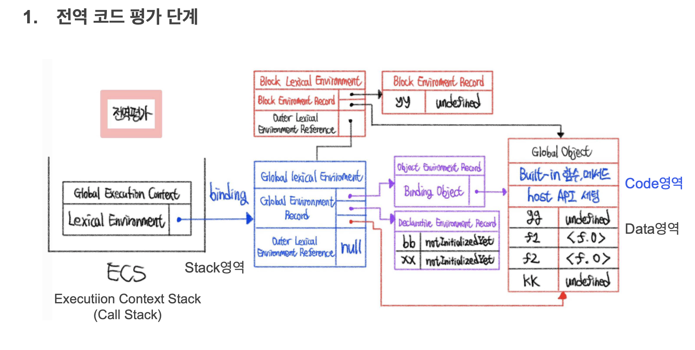
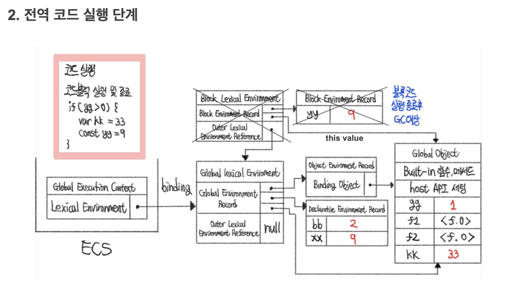
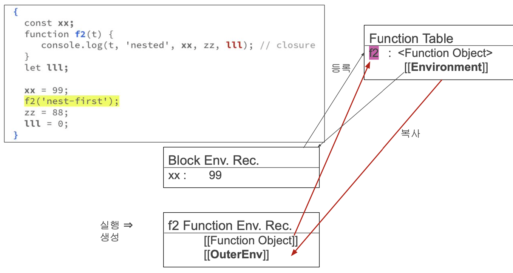
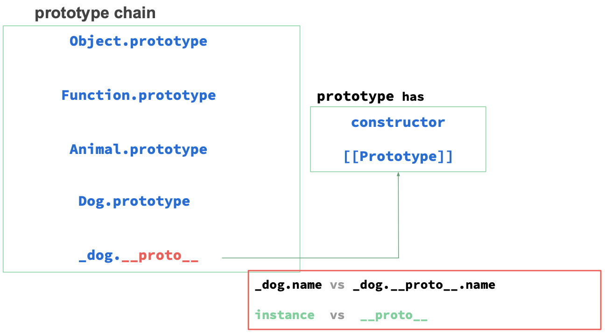
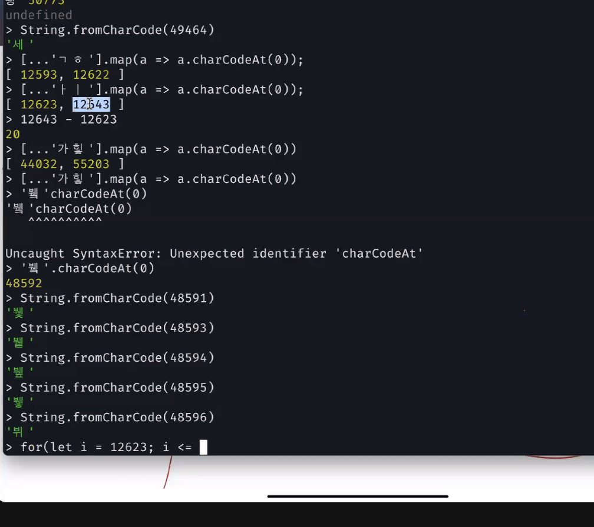
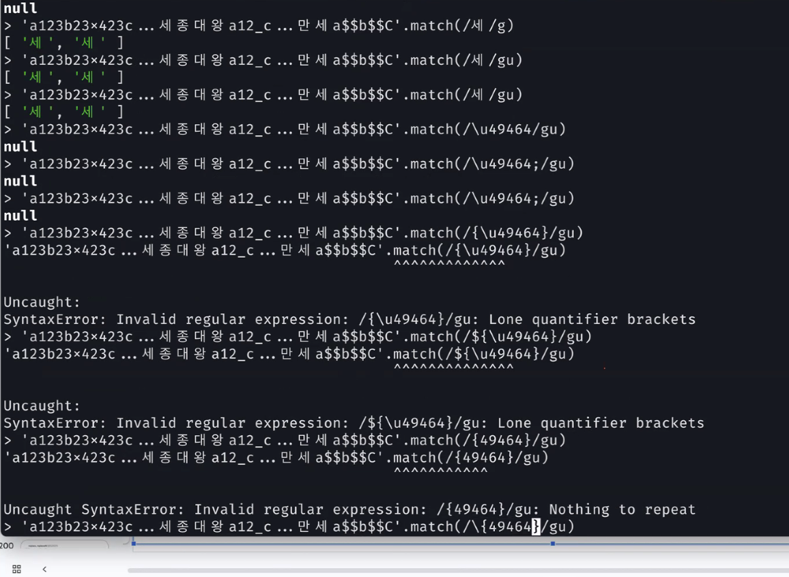

# JavaScript

### 메모리 구조

- kernel (os)
- code (mc)
- data (전역/정적) - null, undefined
- stack (primitive) - variable table(변수 테이블) 존재
- heap (reference)

```jsx
// 평가부
var arr;
var x;

// 실행부
arr = [1, 2];
x = 1;
```


---

## 변수와 타입

- 인터프리터 언어: 선언, 정의 동시에 일어남
- 함수형 프로그래밍 = 선언형

### 변수와 상수

- 변수 = 선언 + 식별자 + 타입 + 값 + 스코프
    - 스코프
        - 전역 스코프: 전 지역에서 사용 가능한 변수 (globalThis)
        - 함수 스코프: 특정 함수 내에서 사용 가능한 변수 (var, function<f.o>)
        - 블록 스코프: 특정 블록 내에서 사용 가능한 변수 (const, let)
    - 타입
        - 값이 저장될 때 정해짐

```jsx
var i = 0;  // var: 함수 scope, i: 식별자
let l = 9;  // block scope
const c = 1;  //상수변수, immutable

function f(){
    var x = 0;
    const c = 1;
    if c -> { let l = 1; }
}
```

### 식별자 규칙

- 문자, $, _ 로 시작
- 유니코드 (utf8)

### mutable/ immutable

- mutable: 메모리 사이즈가 안바뀌는 곳에서  ex. 배열; 주소값을 가진 메모리
- immutable: 변수의 값을 담고 있는 곳

## 변수 타입

**원시형 / 참조형 중요**

- primitive type (value)
    - stack에 존재, LIFO
    - 6가지: 숫자, 문자열/문자열템플릿, boolean, null, undefined, Symbol
    - 문자열, symbol은 constant pool(stack 영역), 나머지 data 영역
    - 메모리에 값이 들어감 → 값이 변경되면 새로운 메모리가 할당됨
- reference type (object)
    - heap에 존재, FIFO
    - 5가지: Array, Date, RegExp, Map/WeakMap, Set/WeakSet
    - new를 쓰면 다 참조형으로 바뀜
    - b=a 하면 같은 메모리 주소를 쓰지만 그 외는 다 주소가 다름
    - == : 값 비교 연산자, === : 값, 주소, type까지 비교 연산자

### stack

- LIFO, 확장 안됨
- call stack: 함수들의 집합, main → f() → f2()
- stack pointer: 현재 위치를 계속 가르킴, stack pointer를 올리면 pop, 내리면 push
- program counter: 다음에 일어날 일을 확인
- 주어진 메모리를 넘으면 stack overflow → limit register

### call stack

- 함수 호출을 관리하는 데이터 구조
- 프로그램이 함수 호출을 할 때마다 그 함수의 정보(예: 함수의 매개변수, 로컬 변수, 반환 주소 등)가 스택에 추가 (push)
- 함수가 완료되면 해당 정보는 스택에서 제거 (pop)

### call stack pointer

- 현재 콜 스택의 최상단을 가리키는 포인터 = 현재 실행 중인 함수 호출의 정보를 가리킴
- 콜 스택 포인터는 함수가 호출될 때마다 스택의 새로운 위치를 가리키도록 업데이트되고, 함수가 종료되면 이전 위치로 돌아감

### constant pool

- data 영역에 존재
    - ps. heap은 무제한으로 메모리를 쓸 수 있음 나머지는 한정된 메모리
- data 영역에서 heap을 참조
- string, Symbol
- null, undefined (\0)

---

## Hoisting (호이스팅)

- 평가하기 위해 선언부를 위로 올리는 것 (변수, 함수 다)
- 없는 선언을 만들어준 것부터 시작됨
- ES5 - strict mode: 선언을 안하면 안돌아감: NaN이 안나오게 하기 위해서
- ES6 -  let, const의 필요성이 대두됨, 변수를 정의하고 사용해
- let, const는 초기화가 필요함; 선언과 초기화가 분리 실행됨, init bit(초기화비트) 필요
- var는 다됨 (전역변수), init bit 없음
- JS: 없는거 호이스팅해도 에러 안남 → typeScript: 없는 거 호이스팅하면 에러

**전역객체**

- var
- 노드를 실행하게 되면

**declarative environment record**

- const, let
- 메모리에 더 가까이 올라가니까 더 빠름
- 빠르기: const > let > var

**해싱**

- 암호화
- 해싱 알고리즘: 진수변환 (긴숫자 짧게)

---

## 연산자

- 산술, 할당, 논리, 비교, 삼항조건, 쉽표, 그룹, 지수, 옵셔널체이닝, 널병합, 비트 등
- 객체/ 클래스: instanceof, in, delet, new, …, destructuring

**산술 연산자**: +, -, *, /, %, 부호, ++, —

```jsx
//** 연산
console.log(2 ** 3 ** 2);  // 뒤에서부터 계산 512(2^9)

// ++ 연산
x = 1;
y = x++;  // y: 1, x = 2
                    // y = x -> x = x+1

y = ++x;  // y: 3, x = 3
                    // x = x+1 -> y = x
```

**할당 연산자**: 기본적으로 뒤에거를 줌

```jsx
// 할당연산자: 뒤에거 가져옴
let a = 1, b = 2;
const c = (a++, b++);  // c = b = 2
```

**논리 비교 연산자**

```jsx
s === 'a';
NaN === NaN;  // false
null == undefined   // true -> 값만 비교: 논리연산 상 둘다 falsy 
null === undefined  // false -> 값 + type(메모리) 비교

// 아래 상태에서 계산식에 넣었을 때 쓰이는 값
undefined // NaN
null      // 0

let un; // undefined = NaN
console.log(un + 1); // NaN

let nu = null; // null = 0
console.log(nu + 2); // 1
```

**쉼표 연산자**

```jsx
// 쉼표+그룹 연산자
q = (p = x = 1, y=2, z=3); // (x: 1, y: 2, z: 3, p: 1, q: 3)
```

**nodemon**

```bash
# nodemon을 global하게 깔기
npm i nodemon -g

# nodemon: deamon이어서 안꺼짐
# -d 붙이면: develop할 때만 씀
```

```jsx
// void 연산
d = void(c = a + b)  // 평가/실행 후 undefined 반환
```

**Falsy vs Truthy**

- falsy: undefined, null, false, 0, NaN, ‘’
- truthy: ‘ ‘(빈칸이 있으면 값이 있다고 봄)

### TDZ (Temporary Dead Zone)

```jsx
// 실행부
console.log(l);
let l = 1;

//선언부
let l;
console.log(l);  // error! 초기화 전에 써서
// ---------------- 여기까지 TDZ; l의 데드존
l = 1;

// - const 일때 -
// 실행부
console.log(l);
const l = 1;

//선언부
const l;
console.log(l); 
l = 1;
```

**freshness**

- 초기화 비트 = 0 인 상태→ 바로 사용 못함
    - 흙당근을 쓰려면 씻어야지 바로 쓸 수 없음
- const, let은 초기화 비트가 있음

**비트 연산자**

| 비트연산자 | 기호 | True |
| --- | --- | --- |
| AND | & | 둘다 참 |
| OR | \| | 하나만 참 |
| XOR | ^ | 둘다 거짓 |
| NOT | ~ | False |

### 숫자

- parseInt: 문자 → 정수
- parseFloat: 문자 → 실수
- .toFixed: 자리수 지정
- Number.EPSILON: 끝에 붙은 값이 쓰레기 값인가?
- Math.trunc(숫자): 정수부만 남기기
- 엘런튜닝의 한계: 보수의버그

```jsx
// 착각하기 수쉬운 연산
null == 0  //flase
[] == 0    // true
false === !!''  // true
!![]  === !!0   // true = false: false
isFinite(Infinity)  // false
parseInt(null)    // NaN
parseFloat(null)  // NaN
Number(null)  // 0
typeof null   // 'object' (null이지만, 이전 코드가 다 오류나기 때문에 object로 유지하기로 한 js bug)
new Number()  // [Number: 0]
isNaN(null)   // false
isNaN('9')    // false
isNaN(dt)     // true: date는 숫자로 저장돼 있음
```

객체/배열 특화 연산자

| 연산자 | 의미 | 사용 |
| --- | --- | --- |
| .(점) | 해당 주소로 가라<br>키값 불러오기 | u.name ↔ u[’name’]<br>object의 key 값은 모두 string 이어야함 |
| [](대괄호) |  | [1, 2, 3] |
| in | 안에 있는지 확인 | ‘id’ in u ↔ u.hasOwnProperty(’id’) ↔ Reflect.has(u, ‘id’) |
| new | 생성자<br>객체 → 인스턴스 | const d = new Dog()<br>: d는 Dog의 인스턴스 |
| instanceof |  | d instanceof Dog |
| …(rest) | 배정되고 남은 값 다가져옴(잔반처리) | function ff(a, b, …c) {} ⇒ f = (…args) |
| delete | (heap에서) 삭제 | delete u.addr |
| arr?.length | arr이 no error나 undefined면 . 해라 | Optional-Chaining (no error, undefined) |

*객체 vs 인스턴스

인스턴스: 클래스가 메모리에 올라가면 인스턴스 (new로 메모리에 올림)

java vs js

- java : 스레드 하나 문제 생기면 하나만 버리고 다음거 실행
- js: 스레드 하나 문제 생기면 그 프로세스 다 죽음

---

## 제어문

### 조건문

- if 문

```jsx
const n = 2;

// if문
if (n == 1){
    console.log('one');
} else if (n == 2){
    console.log('two');
} else if (n == 3){
    console.log('three');
} else {
    console.log('etc');
}

let outStr = 'etc';
if (n == 1){
    outStr = 'one';
} else if (n == 2){
    outStr = 'two';
} else if (n == 3){
    outStr = 'three';
}
console.log(outStr);
```

- switch-case문

```jsx
// switch
switch(n){
    case 1:
        console.log('one');
        break;
    case 2:
        console.log('two');
        break;
    case 3:
        console.log('three');
        break;
    default:
        console.log('etc');
}
```

- 3항 연산자

```jsx
// 3항 연산자
outStr = n === 1 ? 'one' : n === 2 ? 'two' : n === 3 ? 'three' : 'etc';
console.log(outStr);
```

- OR 연산

```jsx
// || 연산자
// outStr = n === 1 || n === 2 || n === 3 ? ['one', 'two', 'three'][n-1] : 'etc';
outStr = 
    (n === 1 ? 'one' : '') ||
    (n === 2 ? 'two' : '') ||
    (n === 3 ? 'three' : 'etc');
console.log(outStr);
```

### 반복문

- for, while, do-while 문

```
// for문
let s = 0;
for (i = 1; i <= 100; i++){
    s += i;
}
console.log("🚀 ~ s:", s);

// while문
s = 0; i = 1;
while(i <= 100){
    s += i++;
}
console.log("🚀 ~ s:", s);

// do-while문
s = 0; i = 1;
do {
    s += i++;
} while(i <= 100);
console.log("🚀 ~ s:", s);
```

- iterable/iterator 한 배열, string에  `of` 사용 가능

```jsx
// 배열 출력
const arr = [1, 2, 3, 4, 5];
for (let i = 0; i < arr?.length; i++){
    console.log(`🚀 ~ arr[${i}]:`, arr[i]);
}

// of 사용해서 배열 출력
for (const t of arr){
    console.log("🚀 ~ t:", t);
}

// 문자열도 이터러블 객체 -> of 사용 가능
const WeakNames = '월화수목금토일';
for (const c of WeakNames){
    console.log("🚀 ~ c:", c);
}
```

---

## 디스트럭처링 (destructuring: 구조 분해 할당)

### **Object Destructuring**

```jsx
const u = {id: 1, name: 'hong', age: 29};
let {id, name, addr} = u;  // let id = user.id; let addr = undefined;
let {id, ...info} = u;  // id = 1, info = {name: 'hong', age: 29}

let id, name;
{id, name} = u;  // Error! 이미 선언했기 때문에 (괄호)로 싸줘야함
({id, name} = u);  // OK! 위에처럼 선언과 같이해주는게 젤 좋음
```

```jsx
const user = { id: 1, name: 'Hong', addr: { city: 'Seoul', road: '길' } };

// id 가져오기
// user.id = user['id'] 이므로 아래 코드들은 모두 같은 의미
const id = user.id;
const { id: id } = user;
const {id} = user;
const {['id']} = user;
x = 'id';
const {[x]} = user;

// id, addr 가져오기
const { id, addr } = user;
const { id: userId, name: userName } = user;

// addr의 city 가져오기
const { city } = addr; // city = 'Seoul'

// id, addr의 city 가져오기
const { id, addr: { city }, } = user;

// id, name, addr의 city 변수명 바꿔서 가져오기
const {
  id: userId,
  name: userName,
  addr: { city: addrCity },
} = user;

console.log(userId, userName, addrCity); //1 Hong Seoul
```

```jsx
// 배열에서 원하는 것만 가져오기
const arr = [1, 2, 3, 4, 5];
const { 1: x1, 3: x2 } = arr;
console.log('🚀 ~ x1, x2:', x1, x2); //  2 4
```

```jsx
const mainField = user.id > 5 ? 'name' : 'addr'; // 화면 크기에 따른 firstname, lastname 같은거 할 때 많이 사용함
const { [mainField]: target } = user; // target = {city: 'Seoul', road: '길'}
console.log('🚀 ~ target:', target);

target = 'kim'; // TypeError: Assignment to constant variable.
const { name: target } = user; // SyntaxError: Identifier 'target' has already been declared

```

### **Array / Iterator Destructuring**

```jsx
// 아래 두개가 같은 뜻이나 실무에서는 destructuring 한 코드로 사용
const a = arr[0];
const [a] = arr;  // destructuring
```

```jsx
// swap
const [a, b] = [1, 2];
[a, b] = [b, a];  // a: 2, b: 1
```

```jsx
// 부분 발췌
const [ , , x, y, , z] = [1, 2, 3, 4, 5, 6];
console.log(x, y, z);  // 3, 4, 6

// no semi colon error
console.log('no-semi-colon')
[c, d] = [1, 2];  // <- SyntaxError!
```

```jsx
const users = [
  { id: 1, name: 'Lee' },
  { id: 2, name: 'Kim' },
  { id: 3, name: 'Park' },
];
const [, , { id: usrId }] = users;
console.log('usrId:', usrId); // 3

```

### Default Value Destructuring

```jsx
// 초기화
const u = {id: 1, name: 'hong', age: 29};
let {id, name, addr = 'Seoul'} = u;  // addr 없으면 Seoul로 초기화

// 배열 초기화
const [d, e, f = 3] = [1, 2];
console.log(d, e, f); // 1 2 3

const [g, h, o = 3] = [1, 2, 0];
console.log(g, h, o); // 1 2 0
```

```jsx
// 위에 users 사용
const [user1, ] = users;
console.log(user1);

const { id, name, addr = 'Seoul' } = { id: 1, name: 'Lee' };
console.log(id, name, addr); // 1 Lee Seoul

const { id, name = 'Lee' } = { id: 1, name: '' };
console.log(id, name); // 1 ''

const { id, name = 'Lee' } = { id: 1, name: undefined };
console.log(id, name); // 1 Lee
```

```jsx
const obj = {i: 1, j:2, l:3, m:4, n:5};
let {j, i, k = i * j} = obj;  // j = 2, i = 1, k = 2
const {l, m, ...restObj} = obj;  // l = 3, m = 4, restObj = { i: 1, j: 2, n: 5 }

// Error
let {i, j, k = i * j * n} = obj;  // Error! not initialized -> n 선언 안됨
let {k = i * 10, i, j} = obj;  // Error! before initialization -> i 선언이 뒤에 있어서 (freshness 상태)

// 미리 선언하면 undefined 값을 가져서 error 안남
let q, s, r;
({r = q * 10, q, s} = {q: 10, s: 20};
```

```jsx
// spread 연산자: rest 연산자랑 다르게 값으로 쓰일때 -> 객체 복사
user2 = { id: 1, name: 'hong', age: 29 };

spread_x = { ...user2 };  // spread 연산자: 객체 복사
console.log(spread_x);    // { id: 1, name: 'hong', age: 29 }

user2.age = 30;           // user 객체의 age 프로퍼티 값 변경
console.log(user2);       // { id: 1, name: 'hong', age: 30 }
```

### Arguments Destructuring

함수가 갖는거

```jsx
// user2 = { id: 1, name: 'hong', age: 30 };

function print({ id, name }) {
  // 객체를 인수로 받음
  console.log(`${id}: ${name}`);
}
print(user2); // 1: hong

// ex2
function fn({ a, b }) {
  console.log(a, b);
}
fn({ a: 1, b: 2 }); // 1 2
```

```jsx
function fn2(...args) {
    console.log('arguments =', arguments);
}
fn2(1, 2, 3); // arguments = [Arguments] { '0': 1, '1': 2, '2': 3 }
```

```jsx
// 함수 선언문 statement
function f() { return 1; }

// 함수 표현식 expression 값이 됨 <f.o> 함수 테이블에 생성
var f = function () { return 1; }

// 변수 테이블에 생성
const f = () => 1;
```

```jsx
// 다시 볼것 
// user2 = { id: 1, name: 'hong', age: 30 };

const { name: n, age = 30 } = { name: 'Lee' }; // n = 30, age = Lee
const { age2 = 30 } = { name: 'Park', age2: 20 }; // age2 = 20

const fn3 = ({ age }) => age;
const { age2: age3 = fn3(user2) } = { age22: 40 };
const { age2: newage } = { age2: 40 };

console.log(age2); // age2는 위에 선언된거 가져옴
console.log(fn3(user2)); // user2.age
console.log(age3); // {age22 = 40}에 age2가 없어서 fn3(user2)의 결과값인 30이 들어감
console.log(newage); // {age2 = 40}에 age2가 있어서 40이 들어감
console.log(age22);  // ReferenceError: age22 is not defined
```

```jsx
// entries 배열 속 배열
```

### Class Destructuring

```jsx
class A{
    constructor(x, y){
        this.a = x;
        this.b = y;
    }
}

const x = new A(1, 2);  // {a: 1, b: 2}로 객체화 됨
const {a, b} = x;
```

### Array to Object Destructuring

```jsx
// {}앞에 const가 있으면 destructuring - 변수명 정함
// const가 없으면 block - key, value
const {id: idd, name: nm} = u;  // 변수명을 idd, nm으로 할게: idd = 1, nm = 'hong'
```

---

## 스코프와 실행컨텍스트

### 스코프

- global
- function
- block
- module: 파일이 4개가 묶어져 있으면 각각 가지는 스코프
- eval: 평가하고 실행 → eval(코드)

**lexical scope**

- outer lexical environment reference: 전역 밖에 있는 lexical에 있는 참조값
    - 나한테 없는거 변수는 내 위에 outer에서 찾음
- static scope: 바뀌지 않음 (초등학교, 고등학교) - js, 인터프리터 언어
- dynamic scope: 어디서 불렀냐에 따라서 scope가 바뀜 - 컴파일 언어

**node/browser구조** (그림 참조)

call stack

call stack의 포인터: stack pointer(SP), instruction pointer(IP)

전역 실행 컨텍스트(global execution(실행할때 생긴다) context)(main)

위에 f, f2, … 쌓임 → f2 pop

### 실행 컨텍스트

- 컨텍스트 = 구역

**Global Object (전역 객체)**

- JS runtime(engine) process 시작시 생성
- Built-in properties & functions
- hose object: browser
- 전역 변수는 전역 객체에 process 종료할 때까지 존재함
- 직접 생성(컨트롤) 못함
- window(globalThis) 생략 가능 (window. / globalThis. 하면 전역객체로 이동)
- var은 전역 객체에 생성, 선언 안하면 암묵적으로 var 사용
- const, let은 전역 객체가 아닌 DER(declarative environment record)에 별도 생성

**encode/ decode**

- encodeURI(): 서버가 인식할 수 있는 문자를 제외하고 인코딩/디코딩
- encodeURIComponent(): 서버가 인식하는 문자까지 다 인코딩/디코딩

**var/function vs const/let**

- var/function: 함수 레벨 스코프
- const/let: 블록 레벨 스코프

- 전역 코드 평가 단계 직접 그려보기 **

  

  
    

## 스트릭트 모드

- JS의 제한된 버전을 선택하여 암묵적인 느슨한 모드(sloppy mode)를 해제하기 위한 방법
- 오해의 소지가 있는 구문을 문법적으로 명확하게 평가
- 호이스팅은 동일하나, 블록 내 함수는 블록 스코프를 갖음
- 선언 필수
- 암묵적 전역(var, implicit global) 허용 안함 → 선언하지 않았다
- delete로 선언된 변수/함수/매개변수 삭제 안됨
- block 내에서 var는  느슨한 모드와 동일한 스코프지만, 함수는 block-scope 임
- 한 함수에서 매개변수(param) 이름 동일하면 안됨 → 중복 선언
- NaN, Infinite 등의 전역 프로퍼티에 값 할당하면 안됨
- ESM(type: “module” in package.json) 모듈은 strict mode로 실행됨
- node에서는 this가 모듈객체를 참조하지 않음 (즉, 전역의 thisValue = undefined)
- package.json에 `“type”: “module”`을 걸어 ESM 모듈 방식으로 설정했다면, ‘use strict’가 없어도 strict mode

```jsx
'use strict';

f = 1;    // ReferenceError: f is not defined
NaN = 1;  // TypeError: Cannot assign to read only property 'NaN' of object
Infinity = 0;
function f(a, a) { console.log('outer f'); }
// SyntaxError: Duplicate parameter name not allowed in this context
delete f; // SyntaxError: Delete of an unqualified identifier in strict mode
```

```jsx
'use strict';

console.log('this=', this);

function f(a) {
  console.log('global f=', a);
}

{
  f(100);
  function f(a) {
    console.log('block f=', a);
  }
}
f(200);

// this= {}
// block f= 100
// global f= 200
```

## 클로저와 실행컨텍스트 심화

### 클로저 (closure)

- 함수와 함수가 선언된 어휘적 환경의 조합
- 상위 스코프의 식별자를 참조하는 하위 스코프(함수/객체 메소드)가 외부에서 지속적으로 참조되어 상/하위 스코프보다 더 오래 살아있는 것
(참조 당하는 EnvRec는 참고하는 EnvRec살아있는 한 죽을 수 없음)
상위/부모 스코프의 식별자를 하위 스코프가 지속적으로 참조 → 하위 스코프가 살아있는 한 상위 스코프는 죽을 수 없다.
- 비순수함수 → `closure` → 순수함수

### **순수함수 vs 비순수함수**

**비순수함수**

- 입력값이 같은데 결과값이 달라지는 함수

```jsx
let count = 0; // 외부변수(오염우려)
function counter() {
  count += 1;
  return count;
}
// 하나의 counter만 사용 가능
console.log(counter());  // 1
console.log(counter());  // 2
console.log(counter());  // 3
```

**순수함수 (Pure function)**

- add() 같이, 같은 입력값을 넣었을 때 결과값 바뀌지 않음
- “side effect(외부의 값을 변경 시킴)를 없애기 위해 순수함수를 사용한다”

```jsx
function counter() {
  let count = 0;
  return function X() {
    count += 1;
    return count;
  };  // closure 함수 부분
}
const counter1 = counter();
const counter2 = counter();
console.log(counter1());  // 1
console.log(counter1());  // 2
console.log(counter2());  // 1
```

```jsx
function f() {
  let count = 0;
  return {
    // count: count
    count, // key, value 같으면 생략 가능
  };
}

const x = f();
console.log('🚀 ~ x.count:', x.count); // 0

```

**Ex 1)**

```jsx
function discount() {
  // cf. currying
  const dcRate = 0.1; // private variable
  return function (price) {
    // 내부함수(:외부에서 dcRate 참조 가능하도록하는 함수를 반환)
    return price * dcRate; // dcRate를 외부에서 직접 접근 못하지만 이 함수는 가능
  }; // 즉, 외부에서 현재 할인율을 알 수는 없음!
}

const items = [
  { item: '상품 A', price: 32000 },
  { item: '상품 B', price: 45000 },
];
const dc = discount();
for (const { item, price: orgPrice } of items) {
  const salePrice = orgPrice - dc(orgPrice); // 실제 판매 금액
  console.log(`${item}: ${orgPrice}원 --> ${salePrice.toLocaleString()}원`);
}
```

실행컨텍스트 그려보기

>

**Ex 2)**

```jsx
function currentCount() {
  let currCount = 0; // private variable
  return {
    connect() {
      currCount += 1;
    },
    disconnect() {
      currCount -= 1;
    },
    getCount() {
      return currCount;
    }, // getter method
    get count() {
      return currCount;
    }, // readonly getter (accessor)
  };
}

const actions = ['입장', '입장', '입장', '퇴장', '입장', '퇴장'];

const counter = currentCount();
for (const action of actions) {
  action === '입장' ? counter.connect() : counter.disconnect();
  console.log(`${action} -> 현재 입장객:  ${counter.count} 명`);
}
console.log('Current User Count=', counter.count); // counter.getCount()
```

실행컨텍스트 그려보기

>

### 함수 object <f.o>

- [[ThisMode]]
- [[Strict]]
- [[Fields]]



## Object & Property

- Object.create: prototype에 만들어짐
- 

```jsx
Object.preventExtensions(user);  // 추가 x, 삭제, 읽기, 쓰기, 재정의 o
Object.seal(user);  // 추가, 삭제, 재정의 x, 읽기, 쓰기o
Object.freeze(user);  // 추가 삭제, 쓰기, 재정의 x, 읽기 o
// 값을 할당해도 오류는 없음
// 하위(중첩) 객체까지 동결(freeze)하지 못함
```

### property

- heap에 존재
- key-value 형태
- prototype의 property, ~~method의 property~~(?) 이런식으로 쓰임
- method는 prototype에 있음

## 함수

- 하나의 단위로 실행되는 문(statement)들의 묶음
- 함수도 객체 <f.o> ⇒ Object(reference type) : 일급객체
- JS: 함수형 언어
- 호출(call, invoke-<f.o>) 당시에 평가되고 실행

```jsx
function Dog(name) {
    this.name = name;
}

Dog('maxx');
console.log(this);  // module
console.log(globalThis.name);  // module

const lucy = new Dog('Lucy');
console.log('lucy =', lucy);
```

```jsx
function hello() {
  return 'Hello, World!';
}

function printFnReturnValue(fn) {
  console.log(fn.name, fn());
}
const ret = printFnReturnValue(hello);
console.log(ret); // undefined
```

### OverLoading vs OverRiding(상속)

함수형 언어에서 함수 이름이 같으면 overloading 안됨, overriding은 됨

- 오버로딩
    - 같은 이름의 메서드를 여러 개 정의하지만, 매개변수의 타입이나 개수가 다르게 정의하는 것
    - 즉, 동일한 메서드 이름을 사용하면서 다양한 매개변수 리스트를 갖는 메서드를 여러 개 정의할 수 있습니다.
    
    ```java
    class MathUtil {
        // 두 개의 정수를 더하는 메서드
        int add(int a, int b) {
            return a + b;
        }
    
        // 세 개의 정수를 더하는 메서드
        int add(int a, int b, int c) {
            return a + b + c;
        }
    
        // 두 개의 실수를 더하는 메서드
        double add(double a, double b) {
            return a + b;
        }
    }
    ```
    
- 오버라이딩
    - 상위 클래스(부모 클래스)에 정의된 메서드를 하위 클래스(자식 클래스)에서 재정의하는 것
    - 하위 클래스는 상위 클래스의 메서드와 동일한 이름, 매개변수, 리턴 타입을 가지는 메서드를 제공하여 기능을 덮어씁니다.
    
    ```java
    class Animal {
        void makeSound() {
            System.out.println("Some generic animal sound");
        }
    }
    
    class Dog extends Animal {
        @Override
        void makeSound() {
            System.out.println("Bark");
        }
    }
    
    class Cat extends Animal {
        @Override
        void makeSound() {
            System.out.println("Meow");
        }
    }
    ```
    

### 즉시 호출 함수 (IIFE: Immediately Invoked Function Expression)

- 선언되자마자 즉시 실행되는 함수 표현식
→ IIFE 내부에 선언된 변수와 함수는 외부에서 접근할 수 없는 독립적인 유효 범위를 갖게 됨
- async 함수 쓸 때 많이 사용함 (비동기 프로그래밍)
- 불필요한 전역 변수와 메모리 낭비를 줄일 수 있다.
- closure(private) / 부분 await 활용 가능.

```jsx
(function() {
  // 여기에 실행할 코드를 작성합니다.
})();  // 즉시 실행

(function () {
  console.log('IIFE');
})();

function hi(name) {
  console.log('Hi', name || this.name);
}

hi.call({ name: 'Lee' }); // Hi Lee
```

### 화살표 함수 (Arrow Function)

- object method와 같은 non-constructor
- arguments 객체(배열)가 다름, 생성자 안됨
- 함수를 반환하는 고차 함수에 활용 (currying)
- 생각 가능: function keyword, 매개변수 1개 일때 괄호, body가 한 문장이면 중활호와 return문
- 내부/콜백 함수 시 this가 외부(상위/전역) 객체
- 화살표 함수가 있는 바깥쪽이 this 다

```jsx
// #1
function f(x) { return x + 1; }

// #2
const f = function (x) { return x + 1 };

// #3
const f = x => { return x + 1; }; 

// #4
const f = x => x + 1; 

console.log('f(2)=', f(2)); // 3
console.log('f(3)=', f(3)); // 4
```

### this를 binding하는 방법: call, apply, bind

- 화살표함수에서는 call, bind, apply 사용 못함 →  무조건 내거를 불러오기 때문


### this

| 실행되는 함수의 종류 | 브라우저 | node |
| --- | --- | --- |
| 함수 선언문<br>function(){} | FunctionDeclaration에 <f.o>로 등록<br>bind 한 객체<br>bind하지 않았다면 전역(globalThisValue) | 좌동 |
| 화살표 함수<br>() => {} | bind 안 됨!<br>전역(globalThisValue) | bind 안 됨!<br>모듈 |
| 객체/instance method | 객체 또는 instance 자신 | 좌동 |
| 함수 선언문 Property | FunctionDeclaration에 <f.o>로 등록<br>소속된 객체 | 좌동 |
| 화살표 함수 Propert<br>화살표 callback 함수 | 소속된 객체의 부모 | 좌동 |

### 콜백 함수 (Callback function)

- event가 있을 때 task queue에 함수를 넣음
- event loop가 계속 돌면서 task queue를 확인하고 일이 있으면 call stack에 올림

### block I/O와 non-block I/O

**block i/o**

- 너가 실행될때까지 기다리는거
- 동기식 입출력 작업으로, 대표적으로 파일 시스템에서 파일을 읽거나 쓸 때 사용
- 블록 I/O 작업은 해당 작업이 완료될 때까지 스레드가 블록되어 있음

**non block i/o**

- 너는 너대로 나는 나대로 = "너(node.js)가 1초를 줬어도 그 사이에 내(os)가 실행해야할거 다 하고 1초 후 한번에 다 로딩할게"
- 비동기적 파일 입출력
- 입출력 작업이 완료되지 않았더라도 다른 작업을 처리할 수 있기 때문에 효율적인 멀티태스킹 가능
- 입출력 작업이 완료되었는지 주기적으로 확인하거나, 콜백 함수를 사용하여 입출력 완료 이벤트를 처리함

### var와 let

- setTimeout: clock, cpu에 있음
- var(함수 scope): 항상 현재(마지막 값) 보여줌
    
    `var`를 사용하여 `i`를 선언하였기 때문에 `i`는 함수 스코프를 가지게 됩니다. 따라서 `setTimeout` 함수의 콜백 함수는 `for` 루프가 이미 종료된 후에 실행되며, 그 시점에서 `i`의 값은 이미 5가 되어 있습니다. 그 결과 모든 `setTimeout` 함수에서 출력 결과는 모두 `var i = 5`가 됩니다.
    

```jsx
for (var i = 0; i < 5; i++) {
    setTimeout(function() {
        console.log("var i =", i);
    }, 1000);
}

// 결과
var i = 5
var i = 5
var i = 5
var i = 5
var i = 5
```

- let(block scope): 실행했던 때의 값 출력
    
    `let` 키워드를 사용한 경우에는 각 루프 반복마다 `i`가 새로운 블록 스코프를 갖기 때문에, 각 `setTimeout`이 해당 루프에서의 `i` 값을 기억합니다. 결과적으로 `setTimeout`이 실행될 때마다 `i`의 값이 변하므로 각 루프에서의 `i` 값이 출력됩니다.
    

```jsx
for (let i = 0; i < 5; i++) {
    setTimeout(function() {
        console.log("let i =", i);
    }, 1000);
}

// 결과
let i = 0
let i = 1
let i = 2
let i = 3
let i = 4
```

### 고차함수

- 인수(매개 변수)로서의 함수
- 반환 값으로서의 함수 (closure)
- 식별자로서의 함수 (1급객체)
- 배열/객체 안의 함수 (배열 원소)
- 즉, 1급 객체로서의 함수

**unary함수**

- 고차함수에서 인수(매개변수)의 개수를 1개로 제한하여 실행
- 고차함수의 한 예시,  기본 함수 아니고 직접 만들어 써야함
- 고차함수의 단점 해결: 매개변수를 받아올 때 NaN이 생기는 경우가 있음 → 해결: unary를 써서 값이 있는 1개만 가져옴
- 인자를 하나만 전달해서 불필요한 연산 안하게함

```jsx
// parseInt(문자열, 진수radix) radix: 2~36진수
['1', '2', '3'].map((a, idx, arg) => parseInt(a)); // [1, 2, 3] // 여기서 parseInt는 callback 함수
['1', '2', '3'].map(parseInt); // [1, NaN, NaN]
['1', '2', '3'].map((a, idx, org) => parseInt(a, idx, org)); // [1, NaN, NaN] // 위에거 evaluate하면 컴퓨터상에서 아래 코드로 바뀜
```

```jsx
// unary 예시
const rets = arr2.map(parseInt);
console.log(rets); // [ 1, NaN, NaN ]
const unary = (fn) => (fn.length === 1 ? fn : (arg) => fn(arg));
const rets2 = arr2.map(unary(parseInt));
console.log(rets2); // [ 1, 2, 3 ]
```

### currying

- ex) dark mode/ light mode
- 코드는 안바뀜 입력만 바뀜

```jsx
const f = () => () => {};

const af = () => {};
// function af() {}

const ff = () => af;
// function ff(){
//   return af;
// return function () {};
// }

// ex1
const f = (restaurant) => () => {메뉴판};

// ex2
f({bg: white, fg: black})
f(mode){
    bg: mode.bg;
    fg: mode.fg;
}

```

## 배열

### 배열

- 객체 (typeof: object)
- 배열의 각 요소는 인덱스로 접근
- length 프로퍼티를 가지며, 배열 길이보다 큰 접근은 undefined
- length를 조정해 배열 길이 조절 가능 (arr.length = 5)
- 배열 메소드에는 순수함수와 비순수함수 모두 포함
- nonhomogeneous(JS): 메모리주소가 정해져 있지 않음 - sparse array(희소배열): 사이즈 정해져있지 않음, key-value
    - homogeneous(C)의 장점: 바로 찾아갈 수 있음 - dense

```jsx
arr = [1, 2, 3];
arr.length = 5;  // arr = [1, 2, 3, ...]
arr.splice(1, 2);  // 1번째부터 2개 지우기 -> arr = [1, ...]
```

### sort(), toSorted()

```jsx
arr = [3, 5, 2, 7, 1];
arr.sort();  // 원본도 바뀜
arr.toSorted();  // 원본은 안바뀜 -> 순수함수

[...arr];  // 원본 복사 -> toSorted 없을 때
[...arr].sort((a, b) => a > b ? -1 : 1); // DESC a기준 크면 왼쪽으로(-1)
[...arr].sort((a, b) => a < b ? -1 : 1); // ASC a기준 작으면 왼쪽으로(-1)
[...arr].sort((a, b) => a - b ); // ASC 숫자일때 가능, 문자는 안됨
```

### split()

```jsx
s = 'a\tb\nc\td\ne\tf';  // 엑셀에서 긁어온 값
s.split('\n')[0].split('\t');  // ['a', 'b']
s.split('\n').map(str => str.split('\t'));  // [ [ 'a', 'b' ], [ 'c', 'd' ], [ 'e', 'f' ] ]
s.split('\n').map(str => str.split('\t')).flat();  // [ 'a', 'b', 'c', 'd', 'e', 'f' ]
s.split(/[\t\n]/);  // 정규표현식 -> 한번에
```

### flat()

- 2차원 배열 → 1차원

### map()

- 배열의 각 요소에 대해 주어진 함수를 호출한 결과를 모아서 새로운 배열을 반환

```jsx
const numbers = [1, 2, 3, 4, 5];

const doubledNumbers = numbers.map(num => num * 2);
console.log(doubledNumbers); // 출력: [2, 4, 6, 8, 10]
```

### push(), pop(), shift(), unshift()

- shift(): 앞에거 뺌
- unshift(): 앞에 추가
- stack (LIFO): [push, pop] ↔ [unshift, shift]
- queue (FIFO): [unshift, pop] ↔ [push, shift]

```jsx
// stack
const stack = [];
stack.push(1);
stack.push(2, 3);
console.log('🚀 ~ stack:', stack); // [1, 2, 3]

const curr = stack.pop();  // 뒤에서부터 빼기
console.log('🚀 ~ curr:', curr); // 3
console.log('🚀 ~ stack:', stack); // [1, 2]

const curr1 = stack.shift();  // 앞에서부터 빼기
console.log('🚀 ~ curr1:', curr1); // 1
console.log('🚀 ~ stack:', stack); // [1]

// queue
const queue = [];
queue.unshift(1);
queue.unshift(2, 3);  // 앞에서부터 넣기
console.log('🚀 ~ queue:', queue); // [2, 3, 1]

const curr2 = queue.pop(); 
console.log('🚀 ~ curr2:', curr2); //  1
console.log('🚀 ~ queue:', queue); // [2, 3]

const curr3 = queue.shift();  // 앞에서부터 빼기
console.log('🚀 ~ curr3:', curr3); //  2
console.log('🚀 ~ queue:', queue); // [3]
```

### indexOf(), lastIndexOf(), findIndex()

```jsx
const lst = ['글1', '글2', '글3', '글4'];

lst.push('글4');
console.log(lst.indexOf('글4'));  // 3 // indexOf는 처음 찾은 것의 인덱스
console.log(lst.lastIndexOf('글4')); // 4 // lastIndexOf는 마지막 찾은 것의 인덱스

const hong = { id: 1, name: '홍길동' };
const kim = { id: 2, name: '김철수' };
const park = { id: 3, name: '박영수' };

const users = [hong, kim, park];
const iduser = users.findIndex((v, i) => v.id === 2);
console.log('🚀 ~ iduser:', iduser);

const id2user = users.find((v) => v.id === 2);
console.log('🚀 ~ id2user:', id2user);

```

### forEach()

- forEach = for + of

```jsx
const hong = { id: 1, name: '홍길동' };
const kim = { id: 2, name: '김철수' };
const park = { id: 3, name: '박영수' };

// 같은 코드
for (const user of users) {
  console.log(user.id, user.name);
}

users.forEach((v) => console.log(v.id, v.name));
```

### filter(), every(), some()

```jsx
const evenusers = users.filter((v) => v.id % 2 === 1); // filter는 끝까지 돌면서 찾음 // 배열로 반환
console.log('🚀 ~ evenusers:', evenusers);

const isEveryLess5 = users.every((v) => v.id < 5); // 모두 만족해야 true
console.log('🚀 ~ isEveryLess5:', isEveryLess5);

const isSomeLess5 = users.some((v) => v.id < 5); // 하나라도 만족하면 true
console.log('🚀 ~ isSomeLess5:', isSomeLess5);

const hasId3 = users.some((v) => v.id === 3);
console.log('🚀 ~ hasId3:', hasId3);
```

### at()

- at(n): n번째 있는 걸 줘

```jsx
const lst2 = [1, 2, 3, 4, 5];

const last = lst2.at(-1);
console.log('🚀 ~ last:', last);
const beforeLast = lst2.at(-2);
console.log('🚀 ~ beforeLast:', beforeLast);
```

### slice()

- 배열 일부 가져오기
- slice(시작 idx, 미만 idx)
- 순수함수

```jsx
const lst2 = [1, 2, 3, 4, 5];

console.log(lst2.slice(-2)); // [4, 5]
console.log(lst2.slice(1, 3)); // [2, 3]
console.log(lst2.slice(1, -2)); // [2, 3]
```

### splice()

- 제거 + 추가
- **splice(sIdx, cnt, ...appends)** // sIdx부터 cnt개 제거 후 appends추가
- 비순수함수

```jsx
const lst2 = [1, 2, 3, 4, 5];

console.log(lst2.splice(2, 3)); // [3, 4, 5] // 원본에서 잘라냄
console.log('🚀 ~ lst2:', lst2); // [1, 2]
console.log(lst2.splice(1, 2, 10, 20)); // [2] // 1번째부터 2개 지우고 10, 20 추가
console.log('🚀 ~ lst2:', lst2); // [1, 10, 20]
```

### concat()

- 합치기

```jsx
const arr1 = [1, 2, 3];
const arr2 = [4, 5, 6];

const arr3 = arr1.concat(arr2);
console.log('🚀 ~ arr3:', arr3); // [1, 2, 3, 4, 5, 6]

const arr4 = [...arr1, ...arr2];
console.log('🚀 ~ arr4:', arr4); // [1, 2, 3, 4, 5, 6]

const arr5 = arr1.concat(4, 5, 6);
console.log('🚀 ~ arr5:', arr5); // [1, 2, 3, 4, 5, 6]

const arr6 = arr1.concat([4, 5, 6]);
console.log('🚀 ~ arr6:', arr6); // [1, 2, 3, 4, 5, 6]

const arr7 = arr1.concat([4, 5], 6);
console.log('🚀 ~ arr7:', arr7); // [1, 2, 3, 4, 5, 6]
```

### reverse(), toReversed()

- 정렬은 안하고 뒤집기만 함

```jsx
arr = [3, 5, 2, 7, 1];
console.log(arr.toReversed()); // [1, 7, 2, 5, 3] // 원본 안바뀜
console.log('🚀 ~ arr:', arr); // [3, 5, 2, 7, 1]

arr.reverse(); // [1, 7, 2, 5, 3]  -> 원본 바뀜
console.log('🚀 ~ arr:', arr); // [1, 7, 2, 5, 3]
```

### assert()

- primitive(원시값) 비교: strictEqual
- object(reference) 비교: deepStrictEqual

```jsx
var assert = require('assert');
```

### 유사 배열 객체(Array-like Object)

- string, object, arguments, DOM NodeList, jQuery 객체 등
- iterable
- length 프로퍼티를 가짐
- for-of를 제외하고 array 메소드 사용 불가 (string은 forEach 안됨)
- Array.from(유사배열객체)로 array로 만들 수 있음

### reduce()

- Array.reduce(cb(현재까지 누산된 값, item) ⇒ 누산로직, 초기값)

```jsx
const sum = arr.reduce( (s, a) => s += a, 0 );
const sum = arr.reduce( (s, a) => s += a );
const sum = arr.reduce( (s, a) => s + a );
```

## 객체 지향 프로그래밍

- primitive(원시) 타입을 제외한 모든 것이 객체(object)
- 배열: 순서가 있는 숫자형(문자열) 인덱스 리스트
- 객체: 문자열/심볼 인덱스(키) 프로퍼티
- object type(except null)과 Class를 통해 생성된 instance type(this)
- JS: prototype 기반 객체 지향 프로그래밍 언어(OOP)
(But, class is constructor function! Function is Object!)
- 객체는 데이터(member variable)와 기능(method)의 논리적 묶음
property는 instance별 EnvRec에 생성되고, method는 prototype에 할당되어 모든 instance가 동일 <f.o> 참조
- 특정 인스턴스에 묶이지(종속되지) 않는 함수를 클래스(정적) 메소드라 한다.

| 특성 | 설명 |
| --- | --- |
| 은닉성 | 캡슐화, 내부(local) 변수 및 메소드 보호 (private, protected, public) |
| 상속성 | 확장성 (extends, mixin, prototype), superclass & subclass |
| 다형성 | polymorphism, interface/ super class |
| 추상화 | abstract class |

### 객체와 인스턴스

```jsx
const obj = {id: 1, name: 'Hong'};
// cf. obj = {..., __proto__: { x: 11 }};

console.log(obj.toString);
Object.getPrototypeOf(obj) === Object.prototype

class Animal {
    // instance(this) + prototpye 생성! (무엇보다 먼저 실행!) 
    constructor(name) {
    this.name = name || super.constructor.name;
  }
}
const dog = new Animal('Dog');
console.log('ok=', Object.keys(obj));
console.log('ak=', Object.keys(dog));

for (let k in dog) console.log('k=', k);

console.log('oh=', obj.hasOwnProperty('id'));
console.log('dh=', dog.hasOwnProperty('id'));
```

```jsx
obj instanceof Object // ? 
Object instanceof Function // ?
Animal instanceof Object
dog instanceof Animal
typeof (dog, obj, [])
typeof Animal

dog instanceof Array
[] instanceof Array
{} instanceof Object
[] instanceof Object
Object.getPrototypeOf([]) === Object.prototype

dog.constructor === Animal // ?

Object.values(dog);
Object.entries(dog);
```

### 프로토타입 - 단방향 LinkedList

```jsx

```



### 정적 필드/ 메소드 -  Class(static) field/ method

- 특정 인스턴스와 무관하고 class에 존재하는 함수(method)
⇒ 인스턴스 프로퍼티를 참조할 수 없다. static 영역에 생성(not prototype)

### Method Overriding & Private Member Variables

- overriding: 부모(super)의 함수(method)를 재정의

```jsx
console.log(dog.toString()); // [Object object]

class Animal {
  ...
    id = 1; // member property
    #age = 10; // private member variable
    
    getAge() { // Override the Object's toString() 
        return this.#age;
    }
    
    toString() { // Override the Object's toString(), [메소드] 다형성! 
        return `This animal's name is ${this.name}.`;
    } 
}

const dog = new Animal('Dog'); 
console.log('id=', dog.id); // ? 
console.log('age=', dog.age); // ? 
console.log('age=', dog.getAge()); // ?

console.log(dog.toString()); // ?
```

### 상속 (extends) - SuperClass & SubClass

- prototype chain을 통한 모든 데이터와 기능을 상속 - object is root class
- Class - Interface - Abstract Class
- 상속: 부모의 구현체(DNA)를 부여 받는다
- 구현: 인터페이스에 정의된 함수를 구현한다. 부모(인터페이스)에는 구현이 없다.
- 추상 클래스: 부모가 일부는 구현, 일부는 정의 → 정의부분만 새롭게 구현
- 다중 상속 - interface(TS), mixin/trait(JS): 여러 클래스를 상속받고 싶다.

## 이터레이터와 제너레이터

### 이터레이터 (iterator)

- 포인터 역할, 현재 어디에 있고 다음에 어디로 가는지
- value, done, next() 이용해 ‘더 쓸모있는 동작이 가능’한 객체를 만듦

**iterable**

- [Symbol.iterator]() 구현 → 실행하면 iterator literal 반환
- Array, Map, Set, string, arguments, NodeList 등

### 제너레이터 (generator)

- function***** 제너레이터 함수)의 실행을 제어하는 함수
- 제너레이터를 호출하면 이터레이터를 얻는다. (실행이 한번에 끝나지 않는다.)
→ 즉 next() 호출 가능
- 실행 시, yield를 만나면 제너레이터는 호출자(caller)에게 정보 반환과 제어권을 넘김 (즉, iterator의 next()와 done이 불필요하고 yield한 만큼만 iterate됨)

```jsx
function* route() {
const start = yield "출발 역은?"; // yield가 있으므로 caller에게 제어권 넘김. yield뒤는 그냥 메시지! const end = yield "도착 역은?";
return `${start}역에서 출발하여 ${end}역에 도착합니다.`;
}
const caller = route(); // next() 함수가 있는것으로 볼 때, "내 안에 이터레이터 있다!"
caller.next(); // undefined보내면 제너레이터는 {value: '출발 역은?', done: false}를 caller에게 보내(반환하)고 일시 정지.
caller.next('문래'); // start에 '문래'를 주입하고, {value: '도착 역은?', done: false}를 caller에게 보내고 일시 정지.
caller.next('신림'); // end에 신림 주입하고, {value: '문래역에서 출발하여 신림역에 도착합니다.', done: true} 반환과 동시에
```

- `function* ~ yield` - iterator를 return하고, 일시정지 하나 상태로 시작

```jsx
function* gener() {
const x = yield 1;
const y = yield (x + 10); console.log('x y =', x, y); return x + y;
}
const it3 = gener();
console.log(it3.next()); // { value: 1, done: false } console.log(it3.next(3)); // { value: 13, done: false }
console.log(it3.next(5));
// x y = 3 5
// { value: 8, done: true }
```

## 맵과 셋

### map

- new Map(), new Map([[k1, v1], [k2, v2]]) - 키: 값, 키는 객체도 가능
- 단순한 객체는 프로퍼티 순서 보장 안됨, spread 불가 → map 필요
- 

### set

- new Set(), new Set([v1, v2, v3, …])
- 중복을 허용하지 않는 데이터 집합
- has(k), add(k, v), delete(k), keys(), values(), entries(), size
- Set의 value가 reference type일 경우 GC 대상이 안됨 (Set 자체가 참조)

### WeakSet(위크셋)

- new WeakSet(), new WeakSet([hong, kim, …]) - 값(객체만 가능)
- value는 object만 가능
- value는 GC 대상 (주소만 갖지 참조는 없음)
- 이터레이터 안됨
- size 프로퍼티와 clear 메소드가 없음
- only (add, has, delete) methods
- 주 용도: 해당 객체가 존재하는지 판단

```jsx
// set과 weakset
const ws = new WeakSet();
const s = new Set();

{
    let obj1 = { id: 1 }; 
    const obj2 = { id: 2 }; 
    ws.add(obj1); 
    s.add(obj1);
    
  ws.add(obj2);
  s.add(obj2);
  
    obj1 = null; // obj1 주소 변경 
    console.log(ws, ws.has(obj1));
    console.log(s, s.has(obj1));
}

console.log(s.size, ws.size);
console.log('ws>', ws);
console.log('s>>', s);
```

## Number, Math, Date

### Number

- new Number(n), Number(n)
- Number.NaN : Not a Number (Number 생략 가능)
- Number.EPSILON : 부동 소수점 문제 해결

### Math

- 수학 관련 상수와 함수 제공
- Math.random(): 0이상 ~ 1미만 실수 난수
- Math.floor((Math.random()*10) + 1) : 1 ~ 10 사이 난수
- Bigint: from ES2020, V8 Engine(10억 비트까지 표현)

### Date

- new Date(), Date()
- 0 === 1970년 1월 1일 0시 0분 0초(UTC)
- typeof Date() === ‘string’

**moment.js**

**debounce**

- delay 기간 중 재 호출 시 기존 호출 무시!즉, 마지막(최종) 호출이 delay초(ms) 후에 실행!

```jsx
const debounce = (cb, delay) => {
let timer;
  return (...args) => {
    if (timer) clearTimeout(timer);
    timer = setTimeout(cb, delay, ...args);
}
}
const act = debounce(a => a + 1, 1000); act(100);
// 1초 동안 n번 호출 => 실행은 1회만!
// 1초 후 => cb(100) 실행
// 1.5초 후 act(100);

```

**throttle**

- delay 기간 별 1회 호출 보장!

```jsx
const throttle = (cb, delay) => {
  let timer;
  return(...args) => {if (timer) return;timer = setTimeout(() => {cb(...args);timer = null;}, delay);
} }
const act = throttle(a => a + 1, 1000); act(100);
// 1초 동안 n번 호출 => 실행은 1회만!
// 10초 동안 n번 호출 => 실행은 10회만!
// 매 1초 마다 => cb(100) 실행
```

## 문자열과 정규 표현식

### 문자열

charCodeAt(idx)



### 정규표현식

- 문자열의 패턴을 기술하는 방법으로 찾기, 추출, 바꾸기 등을 할 수 있다
- 정규식: /pattern/flag
- common character
    
    
    | 표현 | 설명 |
    | --- | --- |
    | \d | 숫자[0-9] |
    | \D | not 숫자 [^0-9] |
    | \w | 영숫자[0-9A-z_] |
    | \W | not 영숫자[^0-9A-z_] |
    | \s | 공백/탭/줄바꿈 |
    | \S | not 공백/탭/줄바꿈 |
    | \x | 16진수 ASCII |
    | \u | 16진수 unicode |
    | . | 개행문제 외 모든 문자 |
- operator
    
    
    | 표현 | 설명 |
    | --- | --- |
    | {n, m} | n개부터 m개 |
    | * | 0개 이상 |
    | + | 1개 이상 |
    | ? | 0개 또는 1개 {0, 1} |
    | ^ | 시작 |
    | $ | 끝 |
    | () | 묶음 |
    | [] | 범위묶음 |
    | [^x] | x제외/not |
    | | | OR |
    
    
    
- flags
    
    
    | 표현 | 설명 |
    | --- | --- |
    | i | ignore |
    | g | global, 있는거 다 찾기, 문자열로 반환 |
    | m | multi-line |
    | y | lastIndex |
    | u | unicode 전체 지원 |
    | s | common-character(.에 개행도 포함) |
    | test | 전화번호, URL, 이메일, 고유번호 validation 체크 |
- match: 문자열 검색
- test: 전화번호, URL, 이메일, 고유번호 validation 체크

```jsx
// 전화번호
/^\d{2,3}-\d{3,4}-\d{4}$/.test('02-2345-2323')  // true
/^\d{3}-\d{3,4}-\d{4}$/.test('010-2345-2323')  // true
/^\d{2,4}-\d{3,4}-\d{4}$/.test('1577-2323')  // false
/^\d{2,4}-\d{3,4}(-\d{4})?$/.test('1577-2323')  // all true

// url
/^http(s?):\/\/.*\..*$/.test('http://thopician.com')  // true
/^http(s?):\/\/.*\..*$/.test('http://thopician')  // false

// email
const regex = /^[A-z0-9][\w-\.]*@[\w-]+\..*([A-z]{2, 7})$/;  //2f_d.f@a.company
regex.test('js123@topician.com');  // true
regex.test('jade123@topician');  // false
regex.test('ja_de.j-u-n@topician.store');  // true 
regex.test('jade@jeon@topician.store');  // false
```

- replace, replaceAll

## 모듈(module)

- 함수들의 집합 (package: 모듈 한개 이상을 모아둠)
- directory 마다 새로 설치!
- package.json: 어떤 패키지가 설치돼있지 알 수 있다
- package-rock.json: 노드 패키지가 어떻게 설치되있는지 상세 정보가 들어가있다. 내가 올린 것과 같은 버전을 동료가 pull 받을 수 있다. (npm i 만 입력하면 없는 것들 다 맞춰서 다운 받아줌)
- 과거에는 CommonJS 방식을 썼었음 → 요즘: ESM
- NodeJS에서 ESM 사용 방법
    - package.json에 `"type": "module",` 추가!

```jsx
var moment = require('moment');  // CommonJS 방식
import moment from 'moment';  // ESM 방식

moment.locale('ko');  // 한국어
```

```jsx
const d = new Date();
console.log('🚀 ~ d:', d.toLocaleString());
const m = moment();
console.log('🚀 ~ m:', m.fromNow());
console.log('🚀 ~ m:', m.format('LLL'));
console.log('🚀 ~ m:', m.format('dddd'));
console.log('🚀 ~ m:', m.format('YYYY-MM-DD (ddd) hh:mm:ss'));

const writtenDate = moment('2024-05-30');
console.log('🚀 ~ writtenDate:', writtenDate.fromNow());
```

### import & export

- 다른파일에 있는 함수를 가져와서 쓰고 싶다
    1. export
    export default를 붙이면 import 할 때 {} 생략 가능 - 1개만 가능
    2. import
        
        ```jsx
        export class Dog extends Animal {}
        export default Cat; // 이렇게 따로 선언해도 됨
        
        import Cat, { Dog } from './oop.js';
        const nabi = new Cat('nabi');
        ```
