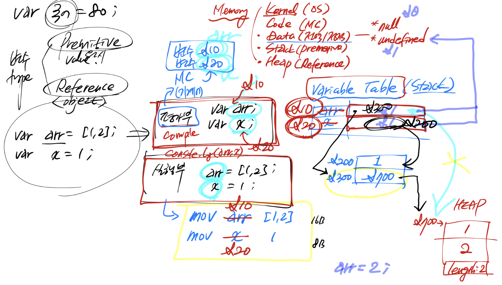

# JavaScript

## 변수 vs 상수 vs 상수항

```jsx
var i = 0;  // var: 함수 scope, i: 식별자
let l = 9;  // block
const c = 1; 

function f(){
    var x = 0;
    const c = 1;
    if c -> { let l = 1; }
}
```

- 인터프리터 언어: 선언, 정의 동시에 일어남
- 함수형 프로그래밍 = 선언형

### 식별자 규칙

- 문자, $, _ 로 시작
- 유니코드 (utf8)

### mutable/ immutable

- mutable: 메모리 사이즈가 안바뀌는 곳에서  ex. 배열; 주소값을 가진 메모리
- immutable: 변수의 값을 담고 있는 곳


## 변수 타입

**원시형 / 참조형 중요**

- premitive type (value)
    - stack에 존재, LIFO
    - 6가지: 숫자, 문자열/문자열템플릿, boolean, null, undefined, Symbol
    - 문자열, symbol은 constant pool(stack 영역), 나머지 data 영역
    - 메모리에 값이 들어감
- reference type (object)
    - heap에 존재, FIFO
    - 5가지: Array, Date, RegExp, Map/WeakMap, Set/WeakSet
    - new를 쓰면 다 참조형으로 바뀜
    - b=a 하면 같은 메모리 주소를 쓰지만 그 외는 다 주소가 다름
    - == : 값 비교 연산자, === : 주소, type 비교 연산자
    
    ```jsx
    // 평가부
    var arr;
    var x;
    
    // 실행부
    arr = [1, 2];
    x = 1;
    ```
    
    
    

### stack

- LIFO, 확장 안됨
- stack pointer: 현재 위치를 계속 가르킴, stack pointer를 올리면 pop, 내리면 push
- program counter: 다음에 일어날 일을 확인
- call stack: 함수들의 집합, main → f() → f2()
- 주어진 메모리를 넘으면 stack overflow → limit register

### constant pool

- data 영역에 존재
    - ps. heap은 무제한으로 메모리를 쓸 수 있음 나머지는 한정된 메모리
- data 영역에서 heap을 참조함
- heap에 있는

### Hoisting (호이스팅)

- 평가하기 위해 선언부를 위로 올리는 것 (변수, 함수 다)
- 없는 선언을 만들어준 것부터 시작됨
- ES5 - strict mode: 선언을 안하면 안돌아감: NaN이 안나오게 하기 위해서
- ES6 -  let, const의 필요성이 대두됨, 변수를 정의하고 사용해
- let, const는 초기화가 필요함; 선언과 초기화가 분리 실행됨, init bit(초기화비트) 필요
- var는 다됨 (전역변수), init bit 없음
- JS: 없는거 호이스팅해도 에러 안남 → typeScript: 없는 거 호이스팅하면 에러

**전역객체**

- var

**declarative environment record**

- const, let
- 메모리에 더 가까이 올라가니까 더 빠름
- 빠르기: const > let > var

freshness

- 흙당근을 쓰려면 씻어야지 바로 쓸 수 없음


### 연산자

```jsx
q = (p = x = 1, y=2, z=3); 
// 쉼표+그룹 (x: 1, y: 2, z: 3, p: 1, q: 3)
```

```jsx
undefined // NaN
null // 0

console.log(2 ** 3 ** 2);  // 뒤에서부터 계산 512(2^9)

x = 1;
y = x++;  // y: 1, x = 2
// y = x -> x = x+1

y = ++x;  // y: 3, x = 3
// x = x+1 -> y = x
```

- 할당연산자: 기본적으로 뒤에거를 줌

```jsx
// 할당연산자: 뒤에거 가져옴
let a = 1, b = 2;
const c = (a++, b++);  // c = b = 2
```

```bash
# nodemon을 global하게 깔기
npm i nodemon -g

# nodemon: deamon이어서 안꺼짐
# -d 붙이면: develop할 때만 씀
```

```jsx
// void 연산
d = void(c = a + b)  // 평가/실행 후 undefined 반환
```

- falsy: undefined, null, false, 0, NaN, ‘’
- truthy: ‘ ‘(빈칸이 있으면 값이 있다고 봄)

