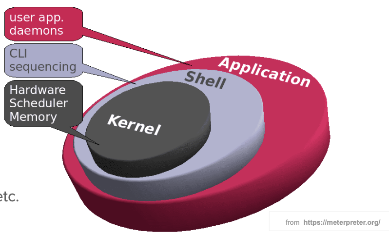
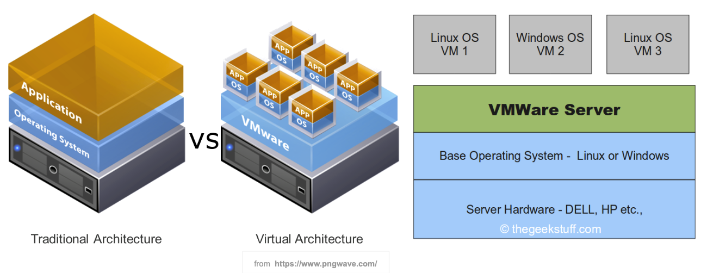
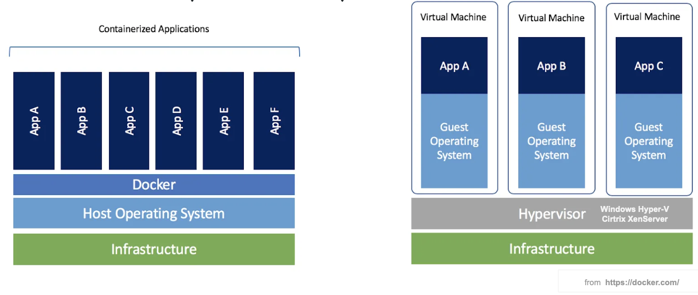
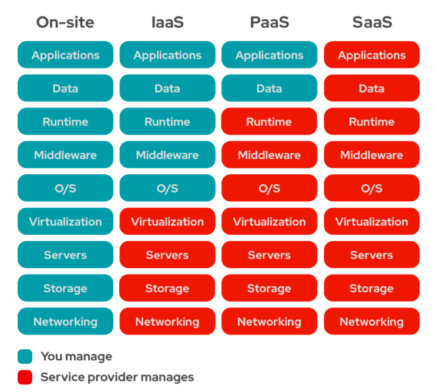
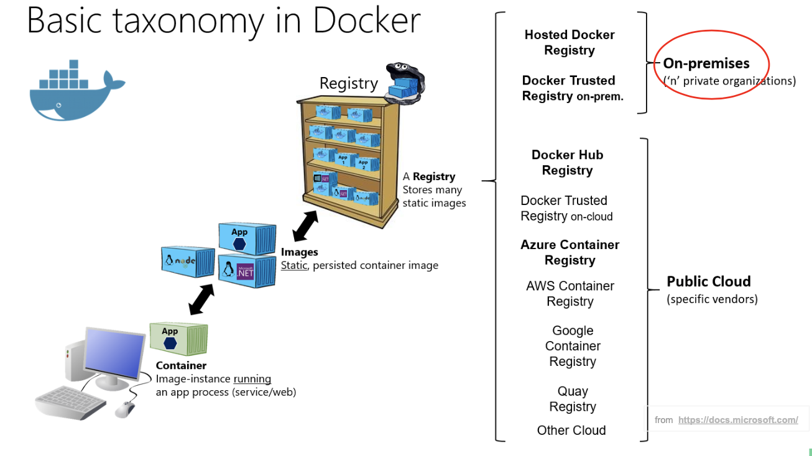
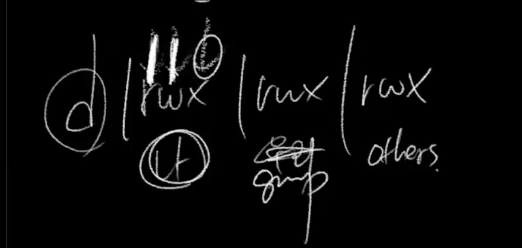
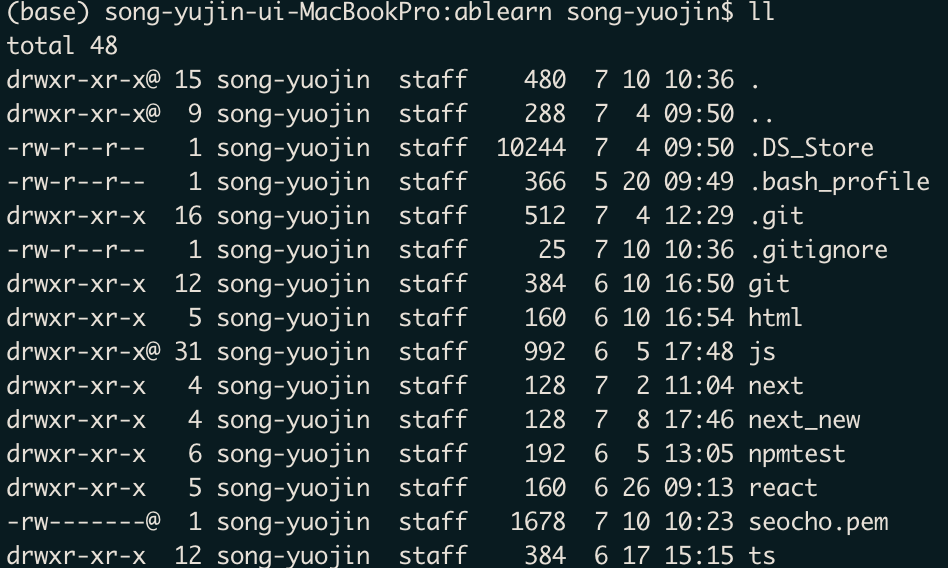
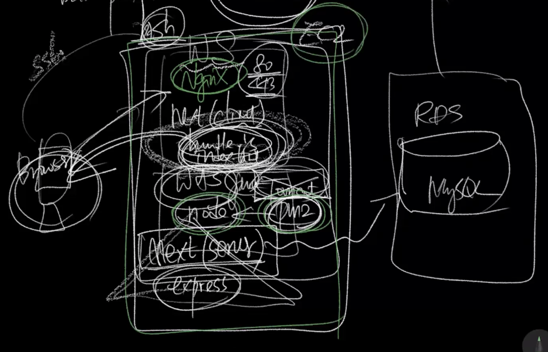

# Linux(Cloud)

Tags: AWS
Start Date: 2024년 7월 8일

## Linux

- GNU
- unix의 kernel을 확장해서 만듦
- git 만든 사람이 Linux 만듦

### Linux Kernel

- Management the Memory, File System, CPU, Device, …
- CentOS 8 - Kernal ver.4.18

### Linux Distro

- Red Hat
    - RHEL (Red Hat Enterprise Linux)
    - CentOS
    - Fedora
- Debian
    - Debain, Ubuntu, KNOPPIX
- Slackware
    - openSUSE(Novell)

### Install Linux

## Cloud Platform

### Serverless(XaaS)

- Serviceful Serverless: Firebase
- FaaS (Fuctions as a Service): Amazon Lambda
- AaaS (Application)
- IaaS (Infrastructure): Public Cloud Infrastructure Hosting
- SaaS (Software): Mail, VAN, Google Docs, game
- PaaS (Platform): Dev, framework&tools, deployment, code lifecycle, DB, APIs

- on-premise: close cloud (회사에서 사용)
    
    
    

## Server Settings

### 알아둘 개념들

- EC2: 컴퓨티드 엔진(os를 탑재한서버)
- os: linux
- machine: 실제 기계,
- virtual: 가상
- image: window, excel, python, linux, mysql 등 모든 어플리케이션(마치 이미지처럼 떠놓은거)
- instance: 실제 떠있는 서버
- 키: pc ↔ EC2 연결 (키페어)
- shell: 명령어들의 집합 (linux 기본 shell: bash shell)
    
    *linux에서 shell 더 깊게(강의 참조): 7/8(월) 04:45:50부분
    

- `chmod 600 seocho.pem` 에서 600의 의미
    
    
    
    
    

- 전체적인 구성: browser, NginX, node, pm2, RDS(sql)
    
    