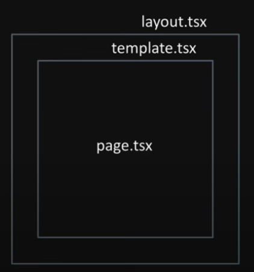

# NextJS

## NextJS

- React-Base FullStack web development framwork

### Next Rendering methods

1. SSG (static site generation)
    - build 시 미리 생성해놓기
2. SSR (server side rendering)
    - 요청(request)시 생성해서 응답
3. ISR (incremental static regeneration)
    - SSG를 점진적으로 수행(유효기간, 갱신기간 등)
4. CSR (client side rendering)
    - client(brower)에서 JS를 실행하여 화면 처리(SEO에 불리)
    - SSG, SSR, ISR과 조합하여 실행(client component)
    - `‘use client’` 를 붙이면 client에서 렌더링 됨

### React Server Components (RSC)

1. RSC (Server components) - Server
    - default
    - 파일 시스템, http, fetching data from DB
    - hook 사용 안됨
2. RCC (Client components) - Browser
    - ‘use client’를 file 상단에 넣어줌
    - hook 사용 가능

### Next.js 설치

```bash
npx create-next-app@latest

# prettier 설치
npm i -D prettier eslint-config-prettier
npm i -D @trivago/prettier-plugin-sort-imports
```

## Route

Layout > Template > Page > Component



### Layout & Page

```bash
mkdir app/hello  (Route Folder)
make app/hello/layout.tsx 
make app/hello/page.tsx
nav to page from Home(app/page.tsx) 

# start
yarn dev
yarn build
```

### Link & next/navigation/useRouter & RouteGroups

- Link (a tag는 자동 생성)
    
    `<**Link** **href**="/" **scroll**={false} **type**="button">Home</**Link**>`
    
- useRouter (only Client Component)
    
    ```tsx
    // useRouter
    import {useRouter} from 'next/navigation'
    const router = useRouter()
    router.push('/dashboard', {scroll: false});
    
    // another functions
    router.back();
    ```
    
- usePathname (only Client Component)
    
    ```tsx
    // usePathname
    import {usePathname} from 'next/navigation'
    const pathname = usePathname()
    ...
    <Link href='...' className={pathname.endsWith(tm) ? 'text-blue-500' :'underline'}
    ```
    
- redirect (Server Component)
    
    ```tsx
    // usePathname
    import {redirect} from 'next/navigation'
    if (..)
    	redirect('/login');
    ```
    
- useSearchParam (only Client Component)
    
    ```tsx
    // useSearchParam
    import {useSearchParam} from 'next/navigation'
    
    // http://.../hello?id=99&name...
    const searchParams = useSearchParams();
    const urlsparams = new URLSearchParams(searchParams.toString());
    const id = searchParams.get('id');
    console.log('id:', id, searchParams, urlsparams);
    
    // update searchParams ex
    const setSearchParams = (name: string, value: string) => {
    	const params = new URLSearchParams(searchParams.toString());
    	params.set(name, value);
    	
    	if (router && pathname) {
    		return router.push(`${pathname}? ${params.toString()}`);
    	}
    	return params.toString();
    }
    ```
    

### 라우터

- A → B로 바뀌는 것
- 라우터 느낌이 나는건 다 폴더로

### 포트

- http: 80
- https: 443
- was: 8000 (막아둠)

### WS vs WAS

- ws:
- was:

- useCallback: 함수를 memoization
- overay: 제일 바깥쪽 - w, h 전체 배경(보통 어둡게 함)
- wrapper: div 덧싼거, z-10하면 전체를 덮음

### Dynamic Routes

- Dynamic Routes for Static Pre-creating (SSG)
- Nested Dynamic Routes

### @parallel Routes

- @parallel routing ex
- Unmatched Routes in Parallel Routes
- Unmatched Routes (Root Default Page)
- Parallel with Conditional Routes

### Intercepting Routes

### Modal component (tailwindcss)

- components/Modal.tsx

## CSR, SSR, SSG, ISR

ssg: default

ssr: 실시간 반영 ex. 주식

isr: 정해준 시간마다 한번씩 새로고침 → 서버가 안바빠짐

### headless

- bootstrap, tailwind 필요 없이 몸통만 있으면 됨
- ex. daisyUI, shadcn(젤 많이 씀)
    - [https://daisyui.com](https://daisyui.com/)
    - [https://ui.shadcn.com](https://ui.shadcn.com/)
- shadcn은 radix-ui 기반

### device route ⭐면접

- device: 마지막 호출로부터 정해진 시간 후에 호출

## NextAuth 소셜 로그인

서버에 API route가 원격에 있다고 생각하면 됨

fetch하면 jsonplaceholder에 부르는거 처럼 내 서버에 부르면 됨

clien-server는 method로 통신함: GET, POST, PUT, PATCH, DELETE, OPTIONS

error: 200, 300-not modified, 400-not found, 500번대

options라는 메소드를 먼저 보냄

캐시된 last modified를 불러옴 → 303 error→ 화면이 안바뀜 다시 불러와야함

```bash
# version이 바껴도 코드를 안바꿔도 됨
yarn add next-auth@beta

# 암호화하는 방식
openssl rand -base64 32
```

google login 연결하기

[https://authjs.dev/reference/core/providers/google](https://authjs.dev/reference/core/providers/google)