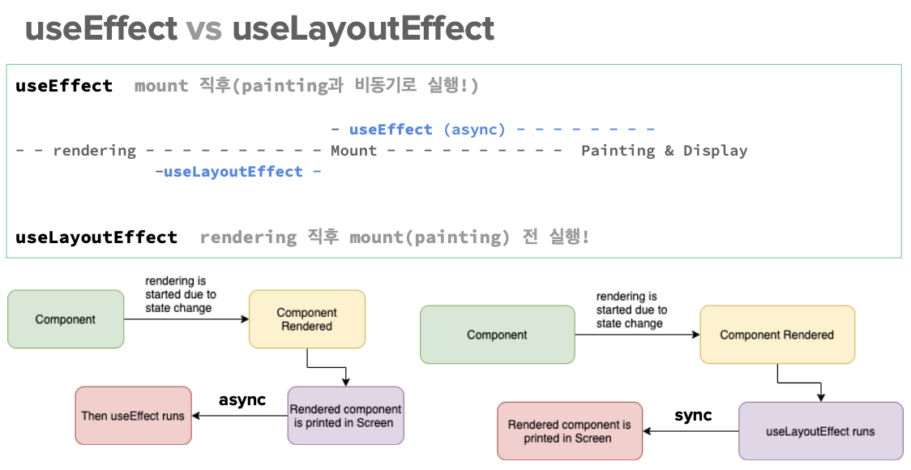

# React

## 리액트 개념

### virtual-dom

- from Fibers: Tree & Scheduler Algorithm
- renderer: 렌더링 담당
- reconciler: DOM의 변경 관리(비동기), 바뀐 부분만 변경해서 real-Dom → virtual-Dom에 보내줌
- React(Virtual)DOM vs Real(Shadow)DOM
- 실시간 반영 해야되는거(주식): `use State(a, b)`, 천천히 반영해도 되는거: 그냥 변수로 `let title = ‘ ’`
    
    → 이런 상태 관리: hook
    

### ReactDOM

- render the ReactElements.
- createElement(tag, attr, …children);
- render(reactElement, reactRoot);

### React.Component

- 컴포넌트: 기능 단위로 묶은 거
- render/ ReactDOM/ life-cycle
- 컴포넌트 생성
    - const Sample = React.createClass({…});
    - class Sample extends React.Component {…}
    - const Sample = (props) => (<> … </>);


**Q. webpack vs babel (면접 ⭐)**

webpack: js 모듈로 돼있는거 패키징 해주는거

babel: 특정 버전의 js로 바꿔주는 거(컨버팅), JSX도 바벨이 컴파일  해줌

### **SWC(Rust) vs ESBuild(Go) vs Babel**

- 속도: SWC > ESBuild >> Babel
- rust: c++ 기반 → 속도 빠름
- go: java기반
- **Vite**: SWC사용 ⇒ “빠르니까 우린 이걸 사용할거야~”
- CRA(create react app): babel 사용 → 느려서 이제 안씀
- Rollup: SWC 대신에 사용 둘디 거의 비슷
- Next: SWC, Rollup 둘 다 사용
- 아이콘들(ex. 사이트 탭에 보이는 아이콘) svg(html tag)로 만듦

### vite 시작 (esbuild + rollup)

```bash
# yarn 설치
# yarn create vite <project-name>
yarn create vite rbvite  # in rbvite/ react, JS+SWC 선택
cd rbvite

yarn  # package.json에 있는 버전들 다 다운 받음
yarn build  # dist 폴더 생성 (실제 배포되는 폴더)
yarn dev  # (개발 버전) src 폴더 내 수정하고 있는 html 보여줌, localhost:5173
yarn preview  # (배포 버전) dist 폴더 내 html 보여줌, localhost:4173
```

- public에 있는 건 안바뀌고 assets에 있는건 실시간으로 바뀜, assets의 파일 이름이 계속 바 → 모든 걸 assets에 넣으면 불러올 때 시간 오래걸림 ⇒ 바꾸지 않을 이미지: public, 바뀌는 이미지: assets

### JSX (JavaScript as XML)

- tree 자료구조 ⇒ Root Element 필수 ⇒ <React.Fragment /> (<> … </>)
- {} 사용, JS 구문 표현 (Type 평가 방식, 표현식 가능)
    
    `const element = <h1>Hello, {name}!</h1>;`
    
- if 대신 3항/논리(&&, ||) 연산자 사용 (단, 논리에 NaN, 0은 표시됨)
- CSS class는 className으로, 그 외 style 키값은 CamelCase로
- root tag 필수, 태크 열었으면 닫기 `<br />`
- 주석 `{/* ~ */}`
- HTML tag는 소문자, 그 외 대분자로 시작 또는 CamelCase
- Injection Attacks에 안전함

### React Component (리액트의 개념)

- component
    - 속성(props)을 받고 상태(state)/Method를 가진다ㅏ
- class component
    - soft는 가능하면 쓰지 말자
- functional component

**Atomic Design**

- Atoms: UI의 최소단위, Input, Button 등
- Molecules: 한개 이상의 Atoms 구성하여 단일한 역할 수행, LoginForm, SearchForm 등
- Organisms: 한개 이상의 Molecules, Presentation 및 Container Components의 조합, NavBar, Header 등
- Templates: Organisms를 조합해서 만든 화면 레이아웃 (CSS)
- Pages: Templates에 Data를 포함하여 완성된 최상위 컴포넌트

**rem vs em (css)**

- 0.8rem: root(body)의 80%
- 0.8em: 지금 있는 태그의 80%

**React Component Props**

- Props:
    - props, childre (React.Node)
    - 속성(변수, 함수 등) 전달
    - `MyComponent.defaultProps = {…}`
- Variables/ Function:
    - 변경된다고 해서 re-rendering 영향 없음
    - 렌더링될 때 한 번만 설정된다. 즉, 렌더링 후에 변경되지 않음
- States
    - 상태변경은 무조건 setState를 사용
    - 부모의 상태가 변경되면, 그 상태를 참조하는 모든 자시 컴포넌트 re-render
        
        (부모가 다시 그려지면(re-render) 자식도 다시 그려지게 됨)
        
        → 상태를 통합하면 re-rendering은 더 많이 일어남 ⇒ 상태를 성격-연관성에 맞게 분리하자 (좁게 사용)
        
        단, Actual(Real Active) DOM은 해당 상태를 참조하는 부분만 다시 그린다. (paint & display)
        
- Component 정리
    - 함수형 컴포넌트 == 순수 함수형 컴포넌트
    - Container Component를 적절히 사용하자
    - 데이터 가져오기와 그리기 분리
    - 상태 공유 단위로 분리 (cf. useContext)
    - 단순 담는 용도의 아주 깊은 container 금지 = container(context) 남발 금지
    - 최대한 독립적으로 작성
    - coupling을 최소화해서 단독으로 사용 가능하도록

**Component LifeCycle**

- 초기화는 처음 한 번만
- index.jsx에서 React.StrictMode로 App이 감싸져 있으면 LifeCycle이 두번씩 호출됨(개발환경에서만)

---

### TailwindCSS in React

- 설치

```bash
# intall
npm install -D tailwindcss postcss autoprefixer
npx tailwindcss init -p
```

- tailwind.config.js

```jsx
/** @type {import('tailwindcss').Config} */
export default {
  content: [
    "./index.html",
    "./src/**/*.{js,ts,jsx,tsx}",
  ],
  theme: {
    extend: {},
  },
  plugins: [],
}
```

- index.css 아래 코드 추가

```jsx
@tailwind base;
@tailwind components;
@tailwind utilities;
```

---

## React Hooks

**: react의 상태 및 life-cyle 관리**

- 상태관리 Hooks
    - useState
    - useContext (createContext)
    - useReducer
- 시점 Hooks
    - useLayoutEffect (paint 전)
    - useEffect (paint 후)
- 메모화 Hooks
    - useMemo
    - useCallback
    - memo
- 그 외 Hooks
    - useRef, useImperativeHandle
    - useDebugValue, useId, useTra …
- Hooks의 3원칙
    1. 컴포넌트 영역 안에서만 작동한다.
    컴포넌트/커스텀훅 내부에서만 호출해야함
    2. 기능을 여러 훅으로 나누면 좋다.
    나누어 있어도 컴포넌트에서 한번에 순차 호출
    함수형 컴포넌트 ⇒ 함수 ⇒ 기능 단위 분히 ⇒ 가독성 ⇒ 테스트 및 유지보수에 유리
    3. 컴포넌트의 최상위 레이어(스코프)에서만 호출해야한다.
    블록 내부에서는 호출할 수 없음

---

## 상태관리 Hook

### useState

- `const [변수, 세터] = useState(초기값);`
- react에 상태를 등록
- 계속 observing함 → 상태가 바뀌면 다시 그려줘야해
- 상태 값은 안바뀜: useState(false)
- 메모리 공간 하나, 초기화 한번

### useContext

- 데이터(상태) 직항
- Privider로 부터 Consumer까지 direct로 value(상태) 공유 (App → Profile)
- Privider의 Children들은 해당 context의 상태를 바로 접근 가능
- Context.Provider ~ Context.Consumer

```jsx
// context pattern 1 (render-prop)
import {createContext} from 'react';
const MyContext = createContext({x: 1});
export MyContext;

// context consumer
import {MyContext} from '../myContext';
<MyContext.Consumer>
	{ (value) => <h1>x: {value.x}</h1> }
</MyContext.Consumer>
```

```jsx
// context pattern 2 (provider-useContext)
export const MyContext = createContext();
render(
	<MyContext.Provider value={{xObj}}>
		<App />
	</MyContext.Provider>
);

// context consumer
import { useContext } from 'react';
import { MyContext } from '../MyContext';
const {xObj} = useContext(MyContext)
```

- 상태를 공유하는 context (useState 보유)
    - 상태가 변경되면 Provider와 모든 자식 component(Consumer) 다시 렌더링 됨
    - setState를 바로 공유하지 말고 상태를 변경하는 함수를 전달하자 (ex. setCount가 아닌, plusCount 노출)

### useReducer

- 위험한 상태변경(setter) 그만
    - reduce: 기존(현재) 값을 바탕으로 추가 액션 (”현재 값은 모르겠고, 아무튼 이 처리 해줘!”) ← 예측 가능한 처리
    `[1, 2, 3].reduce((currSum, a) => currSum + a, 0);`
    - reducer: 기존 값에 무엇인 액션을 해주는 함수
    `setIsActive(!isActive); setCount(count => count + x);` → bad
    `toggle(); plusCount(x);` → good
    - 장점: setter를 직접적으로 노출하지 않으면서 함수를 컴포넌트 외부에 둘 수 있다.
- 상태 관련 함수를 한곳에
    - reducer: 같은 상태를 변경하는 함수들을 한곳에 모아 놓은 것
    - dispatcher(action): action을 전달하는 함수(StrictMode에서는 2회 Call)
    - 장점: 컴포넌트 외부에 상태 변경하는 함수(reducer)를 둘 수 있다

## 시점 Hook

- V-Dom → mount → paint → real-Dom



### useEffect

- mount 후에 painting 되면서 실행
- `useEffect(() => {수행코드 … ; return () => 정리코드;}, [의존관계배열: observer에 등록]);`

### useLayoutEffect

- rendering 직후 mount 전에 실행

```jsx
// A가 바꼈을 때 실행해라
useEffect(() => {
	...
}, [A]
```

## 메모화 Hook

### useMemo

- 변수를 기억해둘게 (값을 캐시)
- 변수를 Static 영역에 cache (value memoization)
- 메모화된 변수는 이제 주소가 변하지 않음

```jsx
const 메모화된 변수 = useMemo(() => { 
	비용이 드는 코드;
	return 메모화할 값;
}, [의존관계 변수들];
```

### Memo

- 컴포넌트

### useCallback

- 함수를 기억해둘게 (함수 캐시) (function memoization)
- 메모화된 함수는 자시 컴포넌트에서 re-render 시 재호출 방지 = 한번만 실행돼야하는 함수를 전달할 때 사용

```jsx
const 메모화된 함수 = useCallback(() => {
	함수 코드;
}, [의존관계 배열]);
```

## 그 외 Hook

### useRef

- `const xRef = useRef();`
- 무엇이든 참조
- 직점 DOM에 접근할 때는 날 불러
- 화면에 영향을 주지 않음?
- V-Dom은 ref를 observe 안함

---

## 기타

- `console.debug` ⇒ build 할 때 없어짐
- 디스트럭쳐링 때문에 props를 실무에서는 잘 안씀
    
    ```jsx
    // My.jsx
    // export default function My(props) {...}
    
    export default function My({ session: { loginUser, cart }, signOut }) {
      return (
        <>
          <strong className="text-green-500">{loginUser?.name}</strong> logined
        </>
      );
    }
    
    ```
    

### let

- 계속 바껴도 되는거
- 함수 부를때 마다 메모리 공간이 바뀜

### setSession

- setter 안에 re-render가 있어서 함수를 다시 부르고 다시 그림

### setCount

- ex setCount(count+1)을 3번 불러도 실행되는 속도가 출력 속도보다 빨라서 결국 모든 결과 값이 setCount(1)이됨
    
    → setCount((count) ⇒ count+1); 로 변경해주면 됨: 16ms를 기다림
    
    ```jsx
    setCount(count+1)
    setCount(count+1)
    setCount(count+1)
    
    setCount((count) => count+1)
    setCount((count) => count+1)
    setCount((count) => count+1)
    ```

---

## React Styling

1. 일반 CSS file
2. styled-components 모듈
3. classnames 모듈
4. jss 모듈
5. emotion 모듈
6. [clsx](https://www.npmjs.com/package/clsx): 가장 많이 씀, `npm install --save clsx`

---

## Deployment and StoryBook

### Deploy to Github

- Github pages로 배포하기
- `yarn add gh-pages -D`
- package.json > script > `“deploy”: “gh-pages -d dist”` 추가

### storybook

- setup: 함수 캐시
- `yarn storybook`
- [https://storybook.js.org](https://storybook.js.org/)