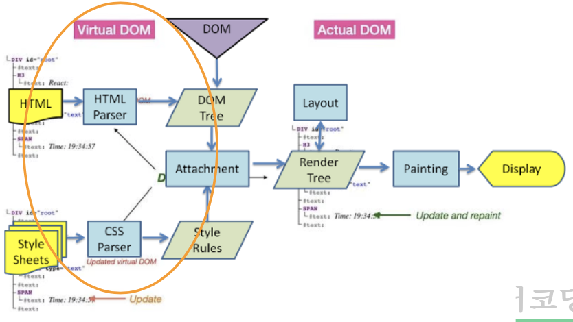

# React

## 리액트 개념

### virtual-dom

- from Fibers: Tree & Scheduler Algorithm
- renderer: 렌더링 담당
- reconciler: DOM의 변경 관리(비동기), 바뀐 부분만 변경해서 real-Dom → virtual-Dom에 보내줌
- React(Virtual)DOM vs Real(Shadow)DOM
- 실시간 반영 해야되는거(주식): `use State(a, b)`, 천천히 반영해도 되는거: 그냥 변수로 `let title = ‘ ’`
    
    → 이런 상태 관리: hook
    

### ReactDOM

- render the ReactElements.
- createElement(tag, attr, …children);
- render(reactElement, reactRoot);

### React.Component

- 컴포넌트: 기능 단위로 묶은 거
- render/ ReactDOM/ life-cycle
- 컴포넌트 생성
    - const Sample = React.createClass({…});
    - class Sample extends React.Component {…}
    - const Sample = (props) => (<> … </>);



**Q. webpack vs babel (면접 ⭐)**

webpack: js 모듈로 돼있는거 패키징 해주는거

babel: 특정 버전의 js로 바꿔주는 거(컨버팅), JSX도 바벨이 컴파일  해줌

### **SWC(Rust) vs ESBuild(Go) vs Babel**

- 속도: SWC > ESBuild >> Babel
- rust: c++ 기반 → 속도 빠름
- go: java기반
- **Vite**: SWC사용 ⇒ “빠르니까 우린 이걸 사용할거야~”
- CRA(create react app): babel 사용 → 느려서 이제 안씀
- Rollup: SWC 대신에 사용 둘디 거의 비슷
- Next: SWC, Rollup 둘 다 사용
- 아이콘들(ex. 사이트 탭에 보이는 아이콘) svg(html tag)로 만듦

### vite 시작 (esbuild + rollup)

```bash
# yarn 설치
# yarn create vite <project-name>
yarn create vite rbvite  # in rbvite/ react, JS+SWC 선택
cd rbvite

yarn  # package.json에 있는 버전들 다 다운 받음
yarn build  # dist 폴더 생성 (실제 배포되는 폴더)
yarn dev  # (개발 버전) src 폴더 내 수정하고 있는 html 보여줌, localhost:5173
yarn preview  # (배포 버전) dist 폴더 내 html 보여줌, localhost:4173
```

- public에 있는 건 안바뀌고 assets에 있는건 실시간으로 바뀜, assets의 파일 이름이 계속 바 → 모든 걸 assets에 넣으면 불러올 때 시간 오래걸림 ⇒ 바꾸지 않을 이미지: public, 바뀌는 이미지: assets

### JSX (JavaScript as XML)

- tree 자료구조 ⇒ Root Element 필수 ⇒ <React.Fragment /> (<> … </>)
- {} 사용, JS 구문 표현 (Type 평가 방식, 표현식 가능)
    
    `const element = <h1>Hello, {name}!</h1>;`
    
- if 대신 3항/논리(&&, ||) 연산자 사용 (단, 논리에 NaN, 0은 표시됨)
- CSS class는 className으로, 그 외 style 키값은 CamelCase로
- root tag 필수, 태크 열었으면 닫기 `<br />`
- 주석 `{/* ~ */}`
- HTML tag는 소문자, 그 외 대분자로 시작 또는 CamelCase
- Injection Attacks에 안전함

### React Component (리액트의 개념)

- component
    - 속성(props)을 받고 상태(state)/Method를 가진다ㅏ
- class component
    - soft는 가능하면 쓰지 말자
- functional component

**Atomic Design**

- Atoms: UI의 최소단위, Input, Button 등
- Molecules: 한개 이상의 Atoms 구성하여 단일한 역할 수행, LoginForm, SearchForm 등
- Organisms: 한개 이상의 Molecules, Presentation 및 Container Components의 조합, NavBar, Header 등
- Templates: Organisms를 조합해서 만든 화면 레이아웃 (CSS)
- Pages: Templates에 Data를 포함하여 완성된 최상위 컴포넌트

**rem vs em**

- 0.8rem: root(body)의 80%
- 0.8em: 지금 있는 태그의 80%

**React Component Props**

- Props:
    - props, childre (React.Node)
    - 속성(변수, 함수 등) 전달
    - `MyComponent.defaultProps = {…}`
- Variables/ Function:
    - 변경된다고 해서 re-rendering 영향 없음
    - 렌더링될 때 한 번만 설정된다. 즉, 렌더링 후에 변경되지 않음
- States
    - 상태변경은 무조건 setState를 사용
    - 부모의 상태가 변경되면, 그 상태를 참조하는 모든 자시 컴포넌트 re-render
        
        (부모가 다시 그려지면(re-render) 자식도 다시 그려지게 됨)
        
        → 상태를 통합하면 re-rendering은 더 많이 일어남 ⇒ 상태를 성격-연관성에 맞게 분리하자 (좁게 사용)
        
        단, Actual(Real Active) DOM은 해당 상태를 참조하는 부분만 다시 그린다. (paint & display)
        
- Component 정리
    - 함수형 컴포넌트 == 순수 함수형 컴포넌트
    - Container Component를 적절히 사용하자
    - 데이터 가져오기와 그리기 분리
    - 상태 공유 단위로 분리 (cf. useContext)
    - 단순 담는 용도의 아주 깊은 container 금지 = container(context) 남발 금지
    - 최대한 독립적으로 작성
    - coupling을 최소화해서 단독으로 사용 가능하도록

**Component LifeCycle**

- 초기화는 처음 한 번만
- index.jsx에서 React.StrictMode로 App이 감싸져 있으면 LifeCycle이 두번씩 호출됨(개발환경에서만)

---

## React Hooks

- 디스트럭쳐링 때문에 props를 실무에서는 잘 안씀

```jsx
// My.jsx
// export default function My(props) {...}

export default function My({ session: { loginUser, cart }, signOut }) {
  return (
    <>
      <strong className="text-green-500">{loginUser?.name}</strong> logined
    </>
  );
}

```