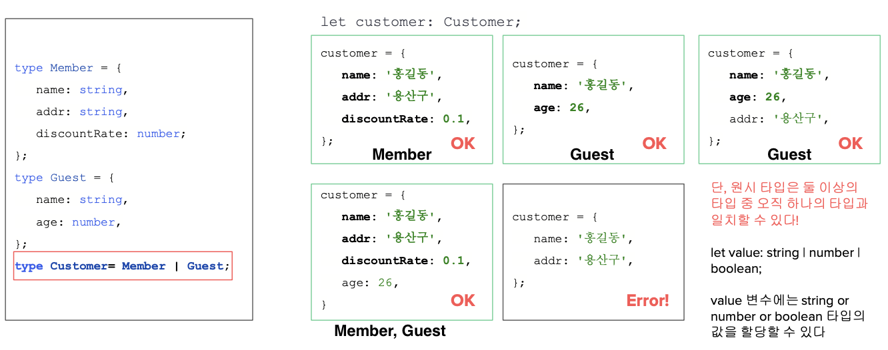
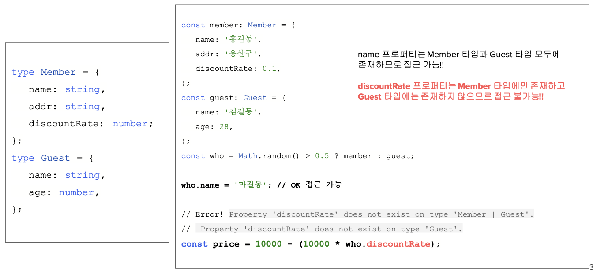

# TypeScript

## TypeScript

- 2012년에 JS를 위해 개발됨
- React TS - 2020

**구성**

1. 프로그래밍 언어
2. 타입 검사기(TypeChecker): 오류 감소
3. 컴파일러(Pre-Compiler): TS → JS
4. 언어지원 서비스(IDE)

⇒ JS에 타입을 부여하고, 부여된 타입을 체크하고, 만족하는 JS 코드를 생성한다.

### TypeScript Compiler (면접 ⭐)

1. Read TSConfig (tsconfig.json): 너가 어디까지 타입을 체크할거니
2. Pre-process Files: follow imports (가능한 모든 파일)
3. Tokenize(Scan) and Parse: text → syntax tree
4. Binder: scope 별로 바인딩
5. Type Check
    1. inference
    2. assignability
    3. structurally typed (Symbol Table)
6. Transform
7. Emit

### install

```bash
npm init -y
npm install -g typescript ts-node
tsc -v
tsc --init

tsc hello.ts  # js 파일 만듦, tsc만 입력해도 됨
node hello.js  # 파일 실행

ts-node hello.ts  # js 파일 안만듦, ts로 실행해서 결과 보기
```

### 타입의 종류

- 타입이 인식하는 원시 타입(primitive type) → JS 7가지 원시타입과 동일
- TS는 JS를 포함하는 슈퍼셋(상위확장)이므로 JS가 지원하는 타입 그대로 사용 가능
1. null
2. undefined
3. boolean
4. string
5. number
6. bigint
7. symbol

## 타입 시스템

- 프로그래밍 언어가 프로그램에서 가질 수 있는 타입을 이해하는 방법에 대한 규칙 집합

### 타입 스크립트의 타입 시스템이 코드를 이해하는 방법

1. 코드를 읽고 존재하는 모든 타입과 값을 이해
2. 각 값이 초기 선언에서 가질 수 있는 타입 확인
3. 각 값이 추후 코드에서 어떻게 사용될 수 있는지 모든 방법을 확인
4. 값의 사용법이 타입과 일치하지 않으면 사용자에게 오류 표시

### 타입 추론 과정

```tsx
let firstName = "Tom"; 
firstName.length();

// Error : This expression is not callable.
// Type 'Number' has no call signatures.
```

타입스크립트가 오류를 표시하는 순서

1. 코드를 읽고 firstName이라는 변수 이해
2. 초깃값이 “Tom”이므로 firstName은 String 타입이라고 결론 지음
3. firstName의 .length멤버를 함수처럼 호출하는 코드 확인
4. string의 .length멤버는 함수가 아닌 숫자라는 오류를 표시

⇒ 함수처럼 호출할 수 없음

### 구문(Syntax)오류 vs 타입 오류

- 구문 오류: TS가 JS로 변환되는 것을 차단한 경우 = JS Syntax Error
- 타입 오류: 타입 검사기에 다라 일치하지 않는 것이 감지된 경우 = TS check system Error

### Type Annotation

- 진화하는 any
- 초기값을 할당하지 않고도 변수의 타입을 선언할 수 있는 구문

## 유니언과 리터럴

### 타입 별칭(Type Alias)

```tsx
type User = { id: number; name: string; addr?: string };
const user: User = { id: 1, name: 'Alice' };
user.addr = 'Seoul';

type Emp = { id: number; name: string; dept: string | number };
const emp: Emp = {
  id: 1,
  name: 'Kim',
  dept: 'Sales',
};
emp.dept = 12;
```

### 리터럴 타입

- 원시 타입보다 더 구체적인 원시 타입, 원시값 자체가 타입이 됨
- 서로 다른 리터럴 타입은 서로 할당 X

```tsx
const Y = 'y'; // y타입
let Z: 'x' | 'y' | 'z' = 'x'; // literal 타입
Z = 'y';
Z = Y;
let N: 1 | 2 | 3 = 3;
```

### 유니언 타입

- 값에 허용되는 타입을 2개 이상의 가능한 타입으로 확장하는 것
- A or B ??? 둘 이상의 타입 중 하나가 아니다 (개 중 하나)
- 둘 이상의 타입으로 확장된 타입에서 일부 속성들의 조합이 어느 하나의 타입에 할당 가능하면 OK
    
    
    
- 유니언으로 선언한 모든 타입에 존재하는 공통되는 속성에만 접근 가능
    
    
    

- 유니언 타입에서 특정 타입에만 존재하는 속성에 접근하고 싶다면?
    
    → type guard를 통해 type narrowing
    
- narrowing: 값이 더 구체적인 타입임을 코드에서 유추하는 것
- type guard: narrowing을 하기 위한 논리적인 검사
    1. 값 할당을 통한 내로잉 (x = 1)
    2. typeof 검사를 통한 내로잉
    3. 조건 검사를 통한 내로잉(if x === ‘stringValue’)
    4. in (cf. hasOwnProperty 는 X)
    5. instanceof
    6. Array.isArray (불규칙 허용)
- typeof narrowing 주의: 검사되는 property만 narrowing (who.spend의 타입이 number[] 타입이라고해서 who의 타입이 Member로 narrowing된 것이 아님!)

### strictNullChecks

- null 혹은 undefined 값을 참조/할당 했을 때 타입 에러 발생 여부
    
    ⇒ 10억 달러의 실수 (NullPointerException) ⇒ `‘strict’: true`
    
- 활성화: null 및 undefined에 대한 오류로 부터 안전 →  항상 `‘strict’: true`로 해놓자
- 비활성화: `‘strict’: false` → null/undefined를 찾을 수 없음!!
    
    ⇒ JS와 같아짐 = TS 쓰는 이유 없어짐
    
    ```tsx
    let a: string | undefined;
    console.log(a?.length);
    console.log(a.length); // error
    ```
    

## 객체 타입

- freshness: 아직 가공이 안된 상태, 쓸 수 없음 (ex. 흙 당근)
    - freshness 끄는 방법:
    1) 변수할당 
    2) type casting (type assertion) 
    3) union으로 체크에서 제외
    4) 함수 통하기 (return)
- Type check system
- CoVariance & ContraVariance
    - 함수의 스펙트럼이 더 큰 놈을 줘야 할당 가능
    - CoVariance: 원래 지정된 것보다 더 많이 파생된 형식을 사용할 수 있다.
    - ContraVariance : 원래 지정된 것보다 더 제네릭한(덜 파생적인) 형식을 사용할 수 있다.
    - TS는 CoVariance
    
    ```tsx
    
    type Xuser = {id: number; name: string};
    type Xemp = {id: number; name: string; addr: string};
    let xuser: Xuser;
    let xemp : Xemp;
    
    xuser = {id:1, name: 'hong'};
    xemp = {id:1, name: 'lee', addr: 'Pusan'};
    
    xuser = xemp; // CoVariance:(id, name) <= (id, name, addr)
    xemp = xuser; // Error! ContraVariance: (id, name, addr) <= (id, name)
    ```